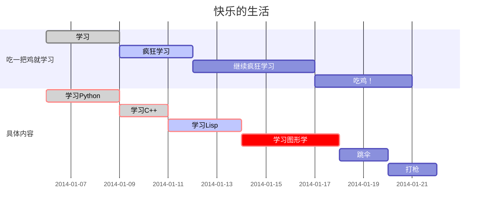

# Linux使用docker配置harbor私有仓库

修改配置文件，并重启docker

```shell
vim /etc/docker/daemon.json
#添加如下配置
{
"insecure-registries":["192.168.1.101:80"]
}

vim /etc/systemd/system/docker.service.d/http-proxy.conf
#添加如下配置
Environment="NO_PROXY=192.168.1.101"

#重启docker
systemctl daemon-reload
systemctl restart docker

#服务器上查询镜像内容
curl -X GET "http://192.168.1.101/api/v2.0/search?q=myproject" -H "accept: application/json"
```

登录私仓，并上传镜像

```shell
#docker登录私仓
docker login 192.168.1.101:80
Username: username
Password：password

#修改镜像tag
docker tag service-test：latest 192.168.1.101:80/myproject/service-test:1.0

#push镜像
docker push 192.168.1.101:80/myproject/service-test

#pull镜像
docker pull 192.168.1.101:80/myproject/service-test
```

# 使用harbor构建docker私仓项目配置

```xml
使用harbor docker私仓，需要先配置本地D:\apache-maven-3.3.9\conf\settings.xml，在servers节点下server节点
  <servers>
    <server>
      <id>myproject-harbor</id>
        <username>username</username>
        <password>password</password>
    	<!--
		<configuration>
    	  <email>chenwei350@huawei.com</email>
	    </configuration>
		-->
    </server>
  </servers>

pom中配置
<properties>
    <!--docker插件-->
    <!-- docker私服地址,Harbor配置完默认地址就是80,默认不带端口号。但是我这里是81 -->
    <docker.repostory>192.168.1.101:80</docker.repostory>
    <!--项目名,需要和Harbor中的项目名称保持一致 -->
    <docker.registry.name>myproject</docker.registry.name>
</properties>

<!--serverId 指定之前在maven的settings.xml中配置的server节点，这样maven会去找其中配置的用户名密码和邮箱-->
<!--registryUrl 指定上面配置的properties属性，即是harbor私服的访问url，注意我设置的使用81端口，默认是80端口-->
<!--imageName 指定上传harbor私服的镜像名，必须和harbor上的url、镜像仓库名保持一致。其中的docker.registry.name就是上面配置的properties属性-->
<plugin>
    <groupId>com.spotify</groupId>
    <artifactId>docker-maven-plugin</artifactId>
    <version>1.0.0</version>
    <configuration>
        <serverId>myproject-harbor</serverId>
        <registryUrl>http://${docker.repostory}</registryUrl>
        <!--必须配置dockerHost标签（除非配置系统环境变量DOCKER_HOST）-->
        <dockerHost>http://10.115.251.29:2375</dockerHost>
        <!--Building image 192.168.10.11/demo1-->
        <imageName>${docker.repostory}/${docker.registry.name}/${project.artifactId}:${project.version}</imageName>
        <!-- 指定 Dockerfile 路径-->
        <dockerDirectory>${basedir}/src/main/docker</dockerDirectory>
        <!-- jar包位置-->
        <resources>
            <resource>
                <targetPath>/</targetPath>
                <!-- target目录下-->
                <directory>${project.build.directory}</directory>
                <!--通过jar包名找到jar包-->
                <include>${pack-name}</include>
            </resource>
        </resources>
    </configuration>
</plugin>

```


```shell
#启动容器
docker run -d --name="mycoco" --net=host -v /automl_log:/automl_log -v /data/nfsrepo:/data/nfsrepo -e "EUREKA_INSTANCE_IP-ADDRESS=10.115.251.29" -e "SPRING_PROFILES_ACTIVE=test" 192.168.1.101:80/myproject/service-test:1.0;

```


```shell
#进入容器
docker exec -it mycoco /bin/bash;
```


<a href="http://www.baidu.com">百度

</a>


```sequence
李雷 -> 韩梅梅: Hello 梅梅, How are you?
Note right of 韩梅梅: 韩梅梅心想
韩梅梅 --> 李雷: I'm fine, thanks, and you?
```

```sequence
chenwei -> chenwei2:啦啦啦
chenwei2 -> chenwei:fanxiang
note left of chenwei2:你看看变化左在要地苛夺我欠遥手说冰淡苛夺二旧蝇 另
chenwei2 -> chenwei3:aa
chenwei3 -> chenwei2:aa
a->b:aa
b->c:sd
c->a:df


```


```flow
st=>start: 闹钟响起
op=>operation: 与床板分离
op1=>operation: qilai

cond=>condition: 分离成功?
e=>end: 快乐的一天

st->op->op1->cond
cond(yes)->e
cond(no)->op
```




| ctrl+t 快速创建table |      |      |
| -------------------- | ---- | ---- |
|                      |      |      |
|                      |      |      |
|                      |      |      |

在


| 文本       | M               | a               | n               |
| ---------- | --------------- | --------------- | --------------- |
| ASSCII编码 | 77              | 97              | 110             |
| 二进制位   | 0 1 0 0 1 1 0 1 | 0 1 1 0 0 0 0 1 | 0 1 1 0 1 1 1 0 |

| 二进制的重新合并４位 | 0 1 0 0 1 1 | 0 1 0 1 1 0 | 0 0 0　1　0　1 | 1 0 1 1 1 0 |
| -------------------- | ----------- | ----------- | -------------- | ----------- |
| 索引                 | 19          | 22          | 5              | 46          |
| Base64编码           | T           | W           | F              | u           |

4


```shell
#快速插入代码块
ctrl+shift+k 
#一级标题、二级标题...最多六级标题
ctrl+1、ctrl+2、ctrl+3、ctrl+4、ctrl+5、ctrl+6
#快速插入表格
ctrl+t


```
