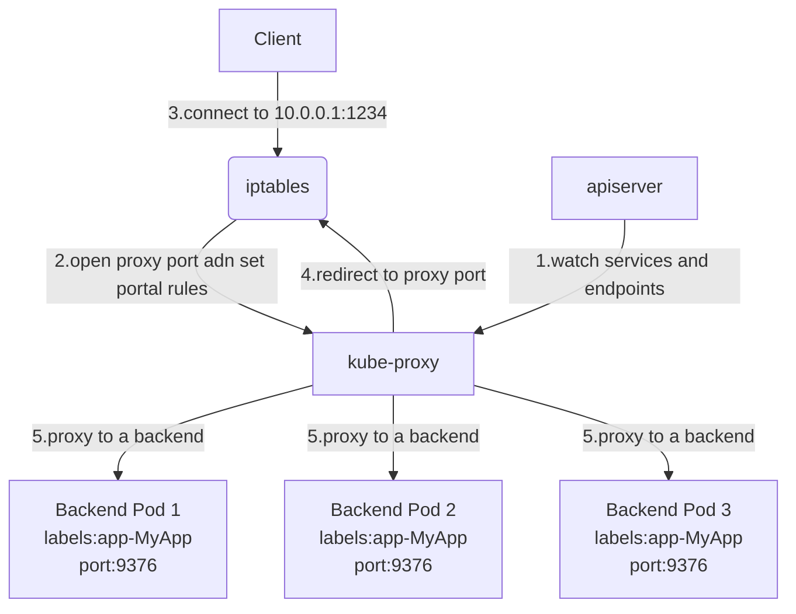
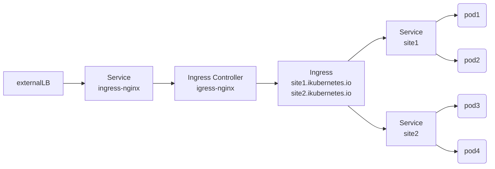

# 1.Service

Service用于解决负载均衡和网络问题。当我们通过Pod或者Deployment在集群中启动容器时，这个容器或者Pod的IP是动态，更何况K8S还会在某些Pod失败时重新调度，更更加了IP的变化。如果IP是动态的，那么我们部署的这些应用如何对外提供服务呢？当然，解决办法有很多，比如用DNS，用etcd，用zookeeper等都可以解决。而这些解决方案都太“基础”了，需要一定的工作量。而通过使用K8S的Service机制，我们可以很容易解决。我们也可以把Service叫作微服务。

定义一个Service需要告诉K8S两件事：

- 一是这个微服务背后的Pod是哪些

- 二是这个微服务通过哪一种网络模式对外提供服务

## 1.1.Service基础导论



- 客户端访问节点通过iptables实现
- iptables的规则是通过kube-proxy写入的
- apiserver通过监控kube-proxy去进行对服务和端点的监控
- kube-proxy通过pod的标签labels判断这个端点信息是否写入到Endpoints里

vip和service代理

在k8s集群中，每个node运行一个kube-proxy进程，kube-proxy为负责为Service实现了一种 VIP（虚拟 IP）的形式，而不是 ExternalName的形式。在 Kubernetes v1.0版本，代理完全在 **userspace**。在 Kubernetes v1.1版本，新增了 **iptables**代理，但并不是默认的运行模式。从 Kubernetes v1.2起，默认就是 iptables代理。在 Kubernetes v1.8.0-beta.0中，添加了 **ipvs**代理。在 Kubernetes 1.14版本开始默认使用 ipvs代理。

在 Kubernetes v1.0版本， Service是 4 层（ TCP/ UDP over IP）概念。在 Kubernetes v1.1版本，新增了 Ingress API（ beta版），用来表示 7 层（ HTTP）服务为何不使用 round-robin DNS？

DNS会在很多的客户端里进行缓存，很多服务在访问 DNS进行域名解析完成、得到地址后不会对 DNS的解析进行清除缓存的操作，所以一旦有他的地址信息后，不管访问几次还是原来的地址信息，导致负载均衡无效。

## 1.2 如何选择Pod

选择Pod使用的是K8S的一种叫做**Label Selector**的机制。

无论在定义Pod还是其他对象时，我们可以非常自由的给这些对象增加一个K-V模式的“标签”，比如MyPodName: http-backend。Label Selector就可以通过各种Label组合，从众多的对象中“选择”出我们期望的那些Pod或其他对象出来。

并且这种选择是动态的，也就是说你可以随时修改Label本身的信息，而对应的Label Selector选择出来的内容也会自动更新。


## 1.3 如何配置网络模式

Service的网络模式，或者是服务类型有四种。**其中NodePort和LoadBalancer两类型的Services可以对外提供服务**。

- ClusterIP(默认)。分配一个集群内可以访问的虚拟IP(VIP)。这种模式比较适合于那些底层和中间层的微服务。
- **NodePort**。在ClusterIP的基础上为Service在每台及其上绑定一个端口。这样可以通过**NodePort**方式来访问服务。
- **LoadBalance**。负载均衡模式。通过指定一个端口，K8S会我们创建一个服务均衡服务。工作在特定的Cloud Provider上，例如Google Cloud，AWS，OpenStack。
- ExternalName。把集群外部的服务引入到集群内来，在集群内直接使用，没有任何类型的代理被创建。类DNS方式，通过制定一个显示的域名来对外暴露服务。这也要求K8S集群安装了1.7或更高版本的kube-dns这个插件

### 1.3.1 ClusterIP

ClusterIP主要在每个node节点使用iptables，将发向ClusterIP对应端口的数据，转发到kube-proxy中。然后kube-proxy自己内部实现有负载均衡的方法，并可以查询到这个service下对应pod的地址和端口，进而把数据转发给对应的pod的地址和端口。

为了实现图上的功能，主要需要以下几个组件的协同工作：

**apiserver**：用户通过 kubectl命令向 apiserver发送创建 service的命令， apiserver接收到请求后将数据存储到 etcd中

**kube-proxy**： k8s的每个节点中都有一个叫做 kube-porxy的进程，这个进程负责感知service、pod的变化，并将变化信息写入本地的 iptables规则中

**iptables**：使用 NAT等技术将 virtualIP的流量转至 endpoint中

```yaml
apiVersion: v1
kind: Service
metadata:
  name: myapp
  namespace: default
spec:
  type: ClusterIP  #服务类型 集群ip
  selector:
    app: myapp
    release: stabel
  ports:
  - name: http
    port: 80  #pod对外开放端口
    targetPort: 80

---

apiVersion: apps/v1
kind: Deployment  #类型
metadata:
  name: myapp-deploy  #名称
  namespace: default
spec:
  replicas: 3  #副本集数量
  selector:
    matchLabels:
      app: myapp  #标签选择,deployment匹配的pod模板标签
      release: stabel
  template:  #pod模板
    metadata:
      labels:
        app: myapp  #pod标签
        release: stabel
        env: test
    spec:
      containers:
      - name: myapp  #pod的名称
        image: myapp:v2
        imagePullPolicy: IfNotPresent
        ports:
        - name: http
          containerPort: 80  #pod对外开放端口
```

### 1.3.2 NodePort

NodePort的原理在于在 Node上开了一个端口，将向该端口的流量导入到 kube-proxy，然后由 kube-proxy进一步到给对应的 pod。

```yaml
apiVersion: v1
kind: Service
metadata:
  name: kube-node-service
  labels:
    app: kube-node-service  #无用
spec:
  type: NodePort      #服务类型 NodePort，可对外使用Node地址访问
  ports:
  - port: 80          #kube-proxy负责为service提供cluster内部的服务发现和负载均衡,clusterIP:port（k8s内部访问）
    targetPort: 8081  #container暴露的端口
    protocol: TCP
    nodePort: 32143   #k8s以外的网络访问service的端口（外部端口）  30000-50000
  selector:
    app: web          #这里选择器 指定pod的标签
```

```shell
# 固定范围在kube-apiserver配置文件下参数
#--service-node-port-range=30000-50000

#创建service
$ kubectl create -f service.yaml
#在master上查看node节点的ip
$ kubectl get nodes -o wide

#另一种创建service的方式，更快更便捷，即使用expose命令来创建service
$ kubectl expose deployment kube-node --type=NodePort
$ kubectl get services
$ kubectl describe service/kube-node
    Type:                     NodePort
    IP:                       10.107.247.158
    Port:                     <unset>  8081/TCP
    TargetPort:               8081/TCP
    NodePort:                 <unset>  31195/TCP
    Endpoints:                10.244.1.71:8081,10.244.2.81:8081  #这里podIp+端口号就是endpoint
$ curl localhost:31195
$ curl 10.107.247.158:8081

#可以看出，expose命令这里并没有指定clusterIP，说明它是K8S系统中的虚拟IP地址，由系统动态分配。
#Pod的IP地址是由flannel插件来分配的，而不再由Docker Daemon根据docker0网桥的IP地址进行分配。可以在任意节点上输入ifconfig可以看到。
```

### 1.3.3 LoadBalance

LoadBalancer和NodePort其实是同一种方式。区别在于LoadBalancer比NodePort多了一步，就是可以调用Cloud provider去创建LB来向节点导流。

使用expose命令创建loadBalancer类型的service

```shell
$ kubectl expose deployment kube-node --type=LoadBalancer
    NAME                TYPE           CLUSTER-IP      EXTERNAL-IP   PORT(S)          AGE
    kube-node           LoadBalancer   10.99.201.195   <pending>     8081:31585/TCP   10s

$ curl localhost:31585
$ curl 10.99.201.195:8081
$ kubectl describe services/kube-node
    Name:                     kube-node
    Namespace:                default
    Labels:                   app=web
    Annotations:              <none>
    Selector:                 app=web
    Type:                     LoadBalancer
    IP:                       10.99.201.195
    Port:                     <unset>  8081/TCP
    TargetPort:               8081/TCP
    NodePort:                 <unset>  31585/TCP
    Endpoints:                10.244.1.71:8081,10.244.2.81:8081
    External Traffic Policy:  Cluster
```

当然我们也可以使用yaml文件来创建，service-lb.yaml文件如下：

```yaml
apiVersion: v1
kind: Service  #service
metadata:
  name: kube-node-service-lb  #名称
  labels:
    name: kube-node-service-lb  #service labels
spec:  #规约
  type: LoadBalancer  #service类型
  clusterIP: 10.99.201.198  #集群内ip
  ports:
  - port: 80  #内部端口
    targetPort: 8081  #容器端口
    protocol: TCP
    nodePort: 32145  #对外端口
  selector:
    app: web  #pod标签
status:
  loadBalancer:
    ingress:
    - ip: 192.168.174.127    #这里是云服务商提供的负载匀衡器的IP地址
```

### 1.3.4 ExternalName

这种类型的 Service通过返回 CNAME和它的值，可以将服务映射到 externalName字段的内容(例：hub.hc.com)。

ExternalName Service是 Service的特例，它没有 selector，也没有定义任何的端口和 Endpoint。相反的，对于运行在集群外部的服务，它通过返回该外部服务的别名这种方式来提供服务。

```yaml
apiVersion: v1
kind: Service
metadata:
  name: my-service-1
  namespace: default
spec:
  type: ExternalName
  externalName: hub.hc.com
```

当查询主机 my-service.defalut.svc.cluster.local时，集群的 DNS服务将返回一个值 hub.hc.com的 CNAME记录。访问这个服务的工作方式和其他的相同，唯一不同的是重定向发生在 DNS层，而且不会进行代理或转发。


# 2.Ingress和Job

还有些概念也非常重要，比如下面几个，都会在使用过程中用到。

- Ingress

- Job

- CronJob


## 2.1.Ingress 简介

Nginx可以通过虚拟主机域名区分不同的服务，而每个服务通过 upstream进行定义不同的负载均衡池，再加上 location进行负载均衡的反向代理，在日常使用中只需要修改 nginx.conf即可实现，但是在 K8S中又该如何实现这种方式调度呢？

K8S引入了 ingress自动进行服务的调度， ingress包含两大组件： **ingress controller**和 **ingress**。

**ingress**：修改 Nginx配置操作被抽象成了 ingress对象。

**ingress controller**： ingress controller通过与 kubernetes API交互，动态的去感知进集群中 Ingress规则变化，然后读取它，按照它自己的模板生成一段 nginx配置，再写到 nginx Pod中，最后 reload。



```yaml
apiVersion: extensions/v1beta1
kind: Deployment
metadata:
  name: nginx-dm
spec:
  replicas: 2
  template:
    metadata:
      labels:
        name: nginx
    spec:
      containers:
      - name: nginx
        image: myapp:v2
        imagePullPolicy: IfNotPresent
        ports:
          containerPort: 80  #pod对外开放端口
---
apiVersion: v1
kind: Service
metadata:
  name: nginx-svc
spec:
  ports:
    - port: 80  #pod对外开放端口
      targetPort: 80
      protocol: TCP
  selector:
    name: nginx
```

创建 ingress:

```yaml
apiVersion: extensions/v1beta1
kind: Ingress
metadata:
  name: nginx-test
spec:
  rules:
    - host:www1.hc.com
      http:
        paths:
        - path: /
          backend:
            serviceName: nginx-svc
            servicePort: 80
```

在 Window系统中配置 hosts后进行访问。

https创建 ingress:

```yaml
apiVersion: extensions/v1beta1
kind: Ingress
metadata:
  name: nginx-https
spec:
  tls:
    - hosts:
      - www2.hc.com
      secretName: tls-secret
  rules:
    - host: www1.hc.com
      http:
        paths:
        - path: /
          backend:
            serviceName: nginx-svc-2
            servicePort: 80
```

**进行 BasicAuth**

```yaml
apiVersion: extensions/v1beta1
kind: Ingress
metadata:
  name: ingress-with-auth
  annotations:
    nginx.ingress.kubernetes.io/auth-type: basic
    nginx.ingress.kubernetes.io/auth-secret: basic-auth
    nginx.ingress.kubernetes.io/auth-realm: 'Authentication Required - foo'
spec:
  rules:
  - auth.hc.com
    http:
      paths:
      - path: /
        backend:
          serviceName: nginx-svc-2
          servicePort: 80
```

**Nginx进行重写**

Nginx重写字段：

| 名称                                           | 描述                                                         | 值     |
| ---------------------------------------------- | ------------------------------------------------------------ | ------ |
| nginx.ingress.kubernetes.io/rewrite-target     | 必须重定向流量的目标URI                                      | 字符串 |
| nginx.ingress.kubernetes.io/ssl-redirect       | 指示位置部分是否仅可访问SSL（当Ingress包含证书时默认为True） | 布尔   |
| nginx.ingress.kubernetes.io/force-ssl-redirect | 即使Ingress未启用TLS，也强制重定向到HTTPS                    | 布尔   |
| nginx.ingress.kubernetes.io/app-root           | 定义Controller必须重定向的应用程序根，如果它在/上下文中      | 字符串 |
| nginx.ingress.kubernetes.io/use-regex          | 只是Ingress上定义的路径是否使用正则表达式                    | 布尔   |

创建igress

```yaml
apiVersion: extensions/v1beta1
kind: Ingress
metadata:
  name: nginx-re
  annotations:
    nginx.ingress.kubernetes.io/rewrite-target: http://www1.hc.com:31347/hostname.html
    nginx.ingress.kubernetes.io/auth-secret: basic-auth
    nginx.ingress.kubernetes.io/auth-realm: 'Authentication Required - foo'
spec:
  rules:
  - host: re.hc.com
    http:
      paths:
      - path: /
        backend:
          serviceName: nginx-svc
          servicePort: 80
```

Window系统中配置hosts后进行访问

## 2.2 Job的简介

容器按照持续运行的时间可分为两类：

- 服务类容器：服务类容器通常持续提供服务，需要一直运行，比如 http server，daemon 等。

- 工作类容器：工作类容器则是一次性任务，比如批处理程序，完成后容器就退出。

Kubernetes 的 Deployment、ReplicaSet 和 DaemonSet 都用于管理服务类容器；对于工作类容器，我们用 Job。

```yaml
apiVersion: batch/v1
kind: Job
metadata:
  name: myjob
spec:
  completions: 6  #要完成的总量 默认是1 可以修改
  parallelism: 2  #有时，我们希望能同时运行多个 Pod，提高 Job 的执行效率。这个可以通过 parallelism设置。并发执行
  template:
    metadata:
      name: myjob
    spec:
      containers:
      - name: hello
        image: busybox
        command: ["echo","hello k8s job!"]
      restartPolicy: Never  #重启策略 只能是Never或者OnFailure，对于其它的controller(比如Deployment)可以设置为Always
```

**定时执行job：**

Linux 中有 cron 程序定时执行任务，Kubernetes 的 CronJob 提供了类似的功能，可以定时执行 Job。

```yaml
apiVersion: batch/v2alpha1
kind: CronJob  #指明当前资源的类型为 CronJob
metadata:
  name: hello
spec:
  schedule: "*/1 * * * *"  #每一分钟启动一次
  jobTemplate:  #定义 Job 的模板，格式与前面 Job 一致
    spec:
      template:
        spec:
          containers:
          - name: hello
            image: busybox
            command: ["echo","hello k8s job!"]
          restartPolicy: OnFailure
```

执行后报如下错误

```shell
$ kubectl apply -f cronjob.yml 
	error: unable to recognize "cronjob.yml": no matches for kind "CronJob" in version "batch/v2alpha1"
```

我们只需要更改一下/etc/kubernetes/manifests/kube-apiserver.yaml，增加如下配置，重启 kubelet服务，然后重新执行这个cronJob

```yaml
spec:
  containers:
  - command:
    - kube-apiserver
    - --runtime-config=batch/v2alpha1=true   #这是新加的
    - --authorization-mode=Node,RBCA
    - --advertise-address=10.0.0.11
    - --allow-privileged=true
    - --client-ca-file=/etc/kubernetes/pki/ca.crt
    ......
```

查看一下api已经被加载

```shell
kubectl api-versions|grep batch/v2
#再次执行
kubectl apply -f cronjob.yml
#获取job
kubectl get jobs
#用jobname 查看日志
kubectl logs hello-151199560-xafs5
```


# 3.StatefulSet和Headless Service简介

StatefulSet是为了解决有状态服务问题，相对应的Deployment和ReplicaSet是无状态服务

其应用场景包括：

稳定的持久化存储-pod即使重新调度后还能访问相同的持久化数据，基于PVC来实现稳定的网络标志，即pod重新调度后PodName和HostName不变

基于Headless Service-也就是没有 Cluster IP的Service来实现。

有序部署，有序扩展，即Pod是有序的，部署或者扩展时要依据定义的顺序依次进行，从0到N-1，在下一个Pod运行之前所有之前的Pod必须都是Running和Ready状态，基于init containers来实现。

有序收缩，有序删除，从N-1到0

StatefulSet的Pod的DNS格式：

```shell
statefulSetName-{0..N-1}.serviceName.namespace.svc.cluster.local
#serviceName为Headless Service的名字
#0..N-1为Pod所在的序号，从0开始到N-1
#statefulSetName为StatefulSet的名字
#namespace为服务所在的namespace，Headless Service和StatefulSet必须在相同的
#namespace
#cluster.local为Cluster Domain
```


Headless Service和普通的service的明显区别：对应每个Endpoints，即每个Pod都会有对应的DNS的域名

例如使用下面的域名来访问具体的pod：

statefulSetName-0.serviceName.namespace.svc.cluster.local

在实际使用中，service的clusterIP设置成**None**就表明service是一个Headless Service。


**StatefulSet和Headless Service的结合**

通过 StatefulSet，我们得到了一些列pod，每个pod的name为statefulSetName-{0..N-1}，再通过Headless Service，我们可以通过pod名称来访问某个pod。

1.创建了一个名称叫eureka的StatefulSet，并且设置replicas =3，那么部署到k8s后，k8s会为我们生成三个名称依次为eureka-0，eureka-1，eureka-2的pod。

2.在namespace=test的命名空间下创建了一个名称为register-server的service，并且关联了之前StatefulSet创建的pod，那么我们可以在集群内任意地方
 通过eureka-0.register-server.test.svc.cluster.local这个域名访问到eureka-0这个pod。


