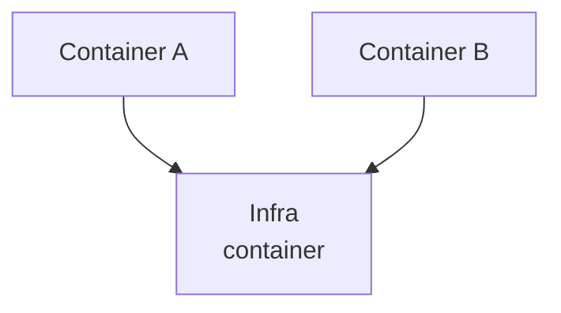
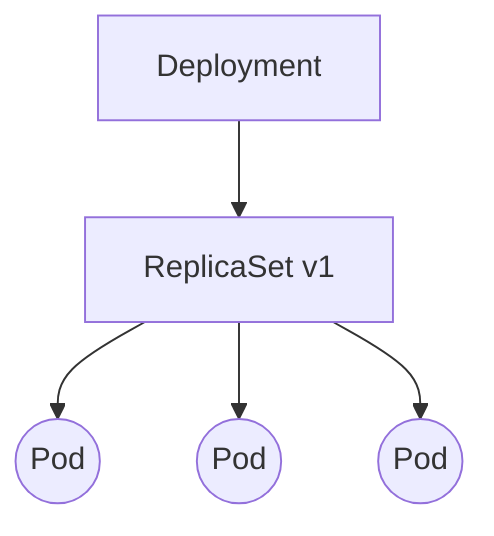

# 1.k8s的节点分类及其组件

- 1.master节点：k8s的主节点，master的组件可以在集群中任何节点上运行，负责管理，集群的所有控制命令都传递给master组件，在master节点上运行。

- 2.node节点：负责运行pod


## 1.1.Master节点的组件

| 组件                     | 作用                                                         |
| ------------------------ | :----------------------------------------------------------- |
| etcd                     | 一个高可用的键值数据库，用于保存集群所有网络配置和资源对象的状态信息，也就是整个集群的状态。<br />有二个插件需要用到etcd<br />1.网络插件flannel，其他网络插件也是用etcd存储网络配置信息<br />2.kubernetes本身，包括各种资源对象的状态和元信息配置<br />（Etcd自身也有watch机制，可用于做服务发现） |
| kube-apiserver           | 负责对外提供restful接口api服务，其他master组件都通过调用api server提供的接口实现各自的功能。<br />如controller就是通过api server来监控资源状态<br />提供了资源操作的唯一入口，同时还提供授权、认证、访问控制、API注册发现等功能。 |
| kube-scheduler           | 监听新建pod副本信息，并通过调度算法为该pod选择一个最合适的Node节点。<br />会检索到所有符合该pod要求的Node节点，执行pod调度逻辑。<br />调度成功之后，会将pod信息绑定到目标Node节点上，同时将信息写入到etcd中。<br />一旦绑定，就由Node上的**kubelet**接手pod的接下来的生命周期管理。<br />如果把scheduler看成一个黑匣子，那么它的输入是pod和由多个Node组成的列表，输出是pod和一个Node的绑定，<br/>即将这个pod部署到这个Node上。<br />Kubernetes目前提供了调度算法，但是同样也保留了接口，用户可以根据自己的需求定义自己的调度算法。 |
| kube-controller-manager  | 负责维护集群的状态，比如故障检测、自动扩展、滚动更新等。<br />每个资源一般都对应有一个控制器，这些controller通过api server实时监控各个资源的状态，<br />controller manager就是负责**管理**这些**控制器**的。<br />当有资源因为故障导致状态变化，controller会尝试将系统由“现有状态”恢复到“期待状态”，<br />保证其下每个controller所对应的资源始终处于期望状态。<br/>比如我们通过api server创建一个pod，当这个pod创建成功后，api server的任务就算完成了。<br />而后面保证pod的状态始终和我们预期的一样的重任就由controller manager去保证了。 |
| cloud-controller-manager | 云控制器管理器是指嵌入特定云的控制逻辑的组件。<br>云控制器管理器使得你可以将你的集群连接到云提供商的 API 之上， <br>并将与该云平台交互的组件同与你的集群交互的组件分离开来。仅运行特定于云平台的控制回路。<br />私有环境不需要云控制管理器。 |

## 1.2.Node节点的组件

| 组件              | 作用                                                         |
| ----------------- | ------------------------------------------------------------ |
| kubelet           | 监视已分配给节点的pod，负责pod的生命周期管理，同时与Master密切协作，维护和管理该Node上面的所有容器，<br />实现集群管理的基本功能。<br />即Node节点通过kubelet与master组件交互，可以理解为kubelet是Master在每个Node节点上面的agent。<br />本质上，它负责使Pod的运行状态与期望的状态一致，<br />同时也负责Volume（CVI）和网络（CNI）的管理 |
| kube-proxy        | 实现service的通信与负载均衡机制的重要组件，将到service的请求转发到后端的pod上<br />是集群中每个节点上运行的网络代理， 实现 Kubernetes [服务（Service）](https://kubernetes.io/zh/docs/concepts/services-networking/service/) 概念的一部分。<br />kube-proxy 维护节点上的网络规则。<br />这些网络规则允许从集群内部或外部的网络会话与 Pod 进行网络通信。 |
| container runtime | 容器运行环境是负责运行容器的软件。<br />Kubernetes 支持多个容器运行环境: <br />[Docker](https://kubernetes.io/zh/docs/reference/kubectl/docker-cli-to-kubectl/)、 [containerd](https://containerd.io/docs/)、[CRI-O](https://cri-o.io/#what-is-cri-o) 以及任何实现 [Kubernetes CRI (容器运行环境接口)](https://github.com/kubernetes/community/blob/master/contributors/devel/sig-node/container-runtime-interface.md)。 |


## 1.3.其他组件

| 组件                  | 作用                         |
| --------------------- | ---------------------------- |
| kube-dns              | 负责为整个集群提供DNS服务    |
| Ingress Controller    | 为服务提供外网入口           |
| Heapster              | 提供资源监控                 |
| Dashboard             | 为集群提供一个可视化的UI     |
| Federation            | 提供跨可用区的集群           |
| Fluentd-elasticsearch | 提供集群日志采集、存储与查询 |


# 2.K8S相关概念

## 2.1.Object

而在K8S的设计理念中，我们可以操作的基本单位统一叫作对象（Object），K8S的有很多种对象类型，比如Pod，Deployment等。

K8S对各种各样的Object定义了Schema，我们只需要按照Schema定义，采用YAML或者JSON等文本格式，作相应的定义即可。

## 2.2.Pod

Pod是K8S中的一种对象，也是最原子化的对象。Pod在英文中含义是豌豆荚，这非常形象的描述了Pod是什么。Pod是一个豆荚，里面装了一个或多个容器。除了容器之外，这个豆荚里面还包括存储资源，一个唯一的IP地址等。其内的多个容器共享这些存储资源和IP地址。在Docker中我们说可以把容器理解成一个非常轻量的”虚拟机“，在这个虚拟机里面我们只启动了一个进程。从这个角度看，Pod才更像一个”虚拟机“。Pod这台机器有自己的存储和IP资源，且这台机器上可以同时运行多个进程（容器）。多个容器之间的通信跟在同一台物理机上通信几乎是一样的，比如可以直接使用**localhost**来完成网络通信。

所以，Pod是我们通过K8S部署一个应用时，要用到的重要的一个方法。我们可以把Docker的一个容器放到Pod中来部署，也可以把互相配合的多个容器都塞到一个Pod中，更方便的部署。比如一个Pod里面运行两个容器，FilePuller容器负责从外部存储把文件拉下来，放到Pod内的Volume存储上。另一个容器WebServer使用Volume中的文件对外提供Web服务。

此外。还可以通过Pod来定义对资源的需求和约束。定义对外的网络通信模式等等。

Pod是K8S的基本构建模块，它是你在K8S集群里能创建或部署的最小和最简单的单元。

**Pod中的多个容器共享网络（ Network Namespace）和文件系统， 因此处于一个Pod中的多个容器共享以下资源：**

- PID命名空间：Pod中不同的应用程序可以看到其他应用程序的进程ID。

- network命名空间：Pod中多个容器处于同一个网络命名空间，因此能够访问的IP和端口范围都是相同的。也可以通过localhost相互访问。
- IPC命名空间：Pod中的多个容器共享Inner-process Communication命名空间，因此可以通过SystemV IPC或POSIX进行进程间通信。
- UTS命名空间：Pod中的多个容器共享同一个主机名。
- Volumes：Pod中各个容器可以共享在Pod中定义分存储卷（Volume）。

Pod 是 Kubernetes 里的原子调度单位。这就意味着，Kubernetes 项目的调度器，是统一按照 Pod 而非容器的资源需求进行计算的。

如果你能把 Pod 看成传统环境里的“机器”、把容器看作是运行在这个“机器”里的“用户程序”，那么很多关于 Pod 对象的设计就非常容易理解了。比如，凡是调度、网络、存储，以及安全相关的属性，基本上是 Pod 级别的。这些属性的共同特征是，它们描述的是“机器”这个整体，而不是里面运行的“程序”。比如，配置这个“机器”的网卡（即：Pod 的网络定义），配置这个“机器”的磁盘（即：Pod 的存储定义），配置这个“机器”的防火墙（即：Pod 的安全定义）。更不用说，这台“机器”运行在哪个服务器之上（即：Pod 的调度）。

Pod 本质：实际上是在扮演传统基础设施里“虚拟机”的角色；而容器，则是这个虚拟机里运行的用户程序。

最后，拿K8S跟OpenStack对比就明白了：

| K8S    | OpenStack              |
| ------ | ---------------------- |
| Pod    | VM                     |
| Docker | application 应用、进程 |

Pod里面的容器共享着Pod里面的CPU、Mem、网络和存储资源。

### 2.2.1.Pod的特点

1.K8S集群的最小单元是Pod，而不是容器；K8S直接管理的也是Pod，而不是容器：

2.Pod里可以运行一个或多个容器：

你也可以把一组有关联关系的容器放在一个Pod里面，这些容器共享着同一组网络命名空间和存储卷。

Pod里的容器共用相同的网络和存储资源：

3.每个Pod会被分配唯一的IP地址，然后里面的容器都会共享着这个网络空间，这个网络空间包含了IP地址和网络端口。Pod容器内部通信用的是localhost，如果要跟外面通信，就需要用到共享的那个IP和端口。

Pod可以指定共享的存储Volume，然后Pod里的所有容器都有权限访问这个Volume。Volume是持久化数据用的，Pod的重启都不会影响Volume里的数据。

### 2.2.2.Pod实例

```yaml
apiVersion: v1  #使用哪个版本的Kubernetes API来创建此对象，此处值是v1，这个版本号需要根据安装的Kubernetes版本和资源类型进行变化，记住不是写死的。
kind: Pod  #要创建的对象类型，根据实际情况，此处资源类型可以是Deployment、Job、Ingress、Service等
metadata:  #用于唯一区分对象的元数据，包括：API对象的name，UID和namespace、标签等信息
  name: nginx
  labels:  #key-value键值对，定义这样的label到Pod后，其他控制器对象可以通过label来定位到此Pod，从而对Pod进行管理
    app: nginx  
spec:  #规约，定义pod及pod下容器的相关配置，包括containers[]，storage，volume以及其他K8s需要的参数，以及诸如是否在容器失败时重新启动容器的属性。
  containers:
  - name: nginx  #容器名称
    image: nginx  #容器使用的镜像
    ports:  #端口列表
    - containerPort: 80  #容器端口
    
#如果我们希望从外部访问这nginx应用，那么我们还需要创建Service对象来暴露IP和port，因为pod的ip和端口不是固定的，在整个集群的Node里分配的
```

在生产环境中，推荐使用诸如Deployment，StatefulSet，Job或者CronJob等控制器来创建Pod，而不是直接创建

```shell
#1.将上述pod描述文件保存为nginx-pod.yaml，使用kubectl create命令运行pod
kubectl create -f nginx-pod.yaml

#2.查看kubectl get 指令的作用，就是从 Kubernetes 里面获取（GET）指定的 API 对象（通过标签查找Pod）。
#在这里我还加上了一个 -l 参数，即获取所有匹配 app: nginx 标签的 Pod。
kubectl get pods -l app=nginx

#3.你还可以使用 kubectl describe 命令，查看一个 API 对象的细节
kubectl describe pod  NAME

#4.更新yaml文件后，如何替换正在运行的pod：
kubectl replace -f nginx-pod.yaml
##但是在这里推荐使用kubectl apply 命令来统一进行 Kubernetes 对象的创建和更新操作##
kubectl apply -f nginx-pod.yaml

#5.如何进入到pod中
kubectl exec -it pod-name -n namespace /bin/bash

#6.如何删除Kubernetes 集群中删除这个 Nginx pod，也可以下面命令列表的命令：
kubectl delete -f nginx-pod.yaml

#7.查看pod日志
kubectl logs pod-name

```

### 2.2.3.Pod内部机制

在 Kubernetes 项目里，Pod 的实现需要使用一个中间容器，这个容器叫作 Infra 容器（也可以叫pause容器）。在这个 Pod 中，Infra 容器永远都是第一个被创建的容器，而其他用户定义的容器，则通过 Join Network Namespace 的方式，与 Infra 容器关联在一起。

所有处于该Pod中的容器在启动时都会添加诸如--net=container:pause --ipc=contianer:pause --pid=container:pause的启动参数，因此pause容器成为Pod内共享命名空间的基础。所有容器共享pause容器的IP地址，也被称为Pod IP。

这样的组织关系，可以用下面这样一个示意图来表达：如图所示，这个 Pod 里有两个用户容器 A 和 B，还有一个 Infra 容器。在 Kubernetes 项目里，Infra 容器占用极少的资源，它使用的是一个非常特殊的镜像，叫作：k8s.gcr.io/pause。这个镜像是一个用汇编语言编写的、永远处于“暂停”状态的容器，解压后的大小也只有 100~200 KB 左右。而在 Infra 容器“Hold 住”Network Namespace 后，用户容器就可以加入到 Infra 容器的 Network Namespace 当中了。所以，如果你查看这些容器在宿主机上的 Namespace 文件，它们指向的值一定是完全一样的。



这也就意味着，对于 Pod 里的容器 A 和容器 B 来说*：*

- 它们可以直接使用 localhost 进行通信；

- 它们看到的网络设备跟 Infra 容器看到的完全一样；
- 一个 Pod 只有一个 IP 地址，也就是这个 Pod 的 Network Namespace 对应的 IP 地址；
- 当然，其他的所有网络资源，都是一个 Pod 一份，并且被该 Pod 中的所有容器共享；
- Pod 的生命周期只跟 Infra 容器一致，而与容器 A 和 B 无关。
- 而对于同一个 Pod 里面的所有用户容器来说，它们的进出流量，也可以认为都是通过 Infra 容器完成的。

这一点很重要，因为将来如果你要为 Kubernetes 开发一个网络插件时，应该重点考虑的是如何配置这个 Pod 的 Network Namespace，而不是每一个用户容器如何使用你的网络配置，这是没有意义的。这就意味着，如果你的网络插件需要在容器里安装某些包或者配置才能完成的话，是不可取的：Infra 容器镜像的 rootfs 里几乎什么都没有，没有你随意发挥的空间。当然，这同时也意味着你的网络插件完全不必关心用户容器的启动与否，而只需要关注如何配置 Pod，也就是 Infra 容器的 Network Namespace 即可。

Pause容器除了为其他容器提供Linux namespace基础，还有其他功能,那就是扮演PID 1的角色，处理僵尸进程。

在一个PID Namespace下，Infra 作为PID为1的进程存在于一个Pod里，其他的业务容器都挂载这个Infra 进程下面。这样，一个PID Namespace下的进程就会以Pause作为根，呈树状的结构存在一个Pod下。

Pause这个容器代码是用C写的，其中Pause的代码里，有个无限循环的for(;;)函数，函数里面执行的是pause( )函数，pause() 函数本身是在睡眠状态的， 直到被信号(signal)所中断。因此，正是因为这个机制，Pause容器会一直等待SIGCHLD信号，一旦有了SIGCHLD信号（进程终止或者停止时会发出这种信号），Pause就会启动sigreap方法，sigreap方法里就会调用waitpid获取其子进程的状态信息，这样自然就不会在Pod里产生僵尸进程了。

最后总结Paused的作用，*它主要有两方面的作用：*

- 扮演PID 1的角色，处理僵尸进程；
- 在Pod里为其他容器共享Linux namespace的基础。

### 2.2.4.Pod的生命周期

Pod的生命周期是Replication Controller进行管理的。一个Pod的生命周期过程包括：

- 通过yaml或json对Pod进行描述

- apiserver（运行在Master主机）收到创建Pod的请求后，将此Pod对象的定义存储在etcd中

- scheduler（运行在Master主机）将此Pod分配到Node上运行

- Pod内所有容器运行结束后此Pod也结束

在整个过程中，Pod的状态是PodStatus对象里的phase字段来表示的，这个phase字段有以下一些值：

- Pending：Pod定义正确，提交到Master，但其所包含的容器镜像还未完全创建。通常，Master对Pod进行调度需要一些时间，Node进行容器镜像的下载也需要一些时间，启动容器也需要一定时间。（写数据到etcd，调度，pull镜像，启动容器）。

- Running：Pod已经被分配到某个Node上，并且所有的容器都被创建完毕，至少有一个容器正在运行中，或者有容器正在启动或重启中。
- Succeeded：Pod中所有的容器都成功运行结束，并且不会被重启。这是Pod的一种最终状态
- Failed：Pod中所有的容器都运行结束了，其中至少有一个容器是非正常结束的（exit code不是0）。这也是Pod的一种最终状态。
- Unknown：无法获得Pod的状态，通常是由于无法和Pod所在的Node进行通信。

 **Restart policy(重启策略)**

定义Pod时，可以指定restartPolicy字段，表明此Pod中的容器在何种条件下会重启。restartPolicy拥有三个候选值：

- Always：只要退出就重启

- OnFailure：失败退出时（exit code不为0）才重启
- Never：永远不重启

**Pod 生命周期控制方法**

Pod本身不具备容错性，这意味着如果Pod运行的Node宕机了，那么该Pod无法恢复。因此推荐使用Deployment等控制器来创建Pod并管理。

一般来说，Pod不会自动消失，只能手动销毁或者被预先定义好的controller销毁。但有一种特殊情况，当Pod处于Succeeded或Failed阶段，并且超过一定时间后（由master决定），会触发超时过期从而被销毁。

三种类型的控制器控制Pod生命周期的方法：

- **Job**：适用于一次性任务如批量计算，任务结束后Pod会被此类控制器清除。**Job的重启策略只能是"OnFailure"或者"Never"**。

- **ReplicationController, ReplicaSet, or Deployment**，此类控制器希望Pod一直运行下去，它们的restart policy只能是"**always**"。

- **DaemonSet**：每个node一个Pod，很明显此类控制器的restart policy应该是"**always**"。

  

## 2.3.ReplicaSet

Pod提供了容器部署的方法，但是我们使用K8S是希望利用分布式集群实现Pod的规模部署。大规模部署要考虑的几个要素包括，我们要重复部署多少份；当其中一个或者多个出现问题了如何自动发现和恢复；甚至当集群中的某些机器宕机了，如何快速在其他机器上把期望数量的Pod重新运行起来；如何实现不停机滚动更新等。RepiacaSet（下称RS）就是解决上面说的这些问题的方案。我们可以定义一个RS告诉K8S，我们要用什么样的Pod，部署多少份。这样，K8S就会利用自身的机制（**ReplicationController**），保证这个期望，甚至在我们要更新时，K8S也通过Roll-Out滚动更新的方式，保证服务处在期待的状态上。


## 2.4.Deployment

在日常使用时并不会经常用到Pod和RS这两个底层的概念，我们**常用的是Deployment**这个概念。Deployment的本质也是一种Object，它对Pod，RS这些概念做了包装，让用户更容易使用。所以Deployment中可以同时定义Pod和RS相关内容。就像Deployment的中文含义，一个部署几乎代表了把一个复杂的系统，通过容器，Pod和RS等技术，高效稳定地部署到一个分布式集群中，而Deployment负责监控这次部署，保证部署的稳定性。还提供快速扩容，滚动更新，回滚等功能。到这里，Deployment机制基本上把各种的问题给解决了（资源调度、滚动更新、横向扩容、高可用、故障重启等，甚至更多）。

### 2.4.1.k8s的控制器类型

- 控制器又被称为工作负载，pod通过控制器实现应用的运维，比如伸缩、升级等
- Kubernetes中内建了很多controller（控制器），这些相当于一个状态机，用来控制Pod的具体状态和行为

1、**deployment**：适合无状态的服务部署

2、**StatefullSet**：适合有状态的服务部署

3、**DaemonSet**：一次部署，所有的node节点都会部署，例如一些典型的应用场景：

 - 运行集群存储 daemon，例如在每个Node上运行 glusterd、ceph
 - 在每个Node上运行日志收集 daemon，例如 fluentd、 logstash
 - 在每个Node上运行监控 daemon，例如 Prometheus Node Exporter

4、**Job**：一次性的执行任务

5、**Cronjob**：周期性的执行任务

### 2.4.2.Deployment控制器

Deployment实现了Pod 的“水平扩展 / 收缩”（horizontal scaling out/in），适合部署无状态的应用服务，用来管理pod和replicaset，具有上线部署、副本设定、滚动更新、回滚等功能，还可提供声明式更新，例如只更新一个新的Image。

Deployment如何控制pod

这些控制器被统一放在 kubernetes/pkg/controller 目录下，因为它们都遵循 Kubernetes 项目中的一个通用编排模式，即：控制循环（control loop）。

比如，现在有一种待编排的对象 X，它有一个对应的控制器。

那么，我就可以用一段 Go 语言风格的伪代码，为你描述这个控制循环：

```java
for {
  实际状态 := 获取集群中对象o的实际状态（Actual State）
  期望状态 := 获取集群中对象o的期望状态（Desired State）
  if 实际状态 == 期望状态{
    什么都不做
  } else {
    执行编排动作，将实际状态调整为期望状态
  }
}
```

在具体实现中，实际状态往往来自于 Kubernetes 集群本身。比如，kubelet 通过心跳汇报的容器状态和节点状态，或者监控系统中保存的应用监控数据，或者控制器主动收集的它自己感兴趣的信息，这些都是常见的实际状态的来源。

而期望状态，一般来自于用户提交的 YAML 文件。比如，Deployment 对象中 Replicas 字段的值。很明显，这些信息往往都保存在 Etcd 中。

接下来，以 Deployment 为例，我和你简单描述一下它对控制器模型的实现：

- Deployment 控制器从 Etcd 中获取到所有**携带了“app: nginx”标签的 Pod**，然后统计它们的数量，这就是实际状态；
- Deployment 对象的 Replicas 字段的值就是期望状态；Deployment 控制器将两个状态做比较，然后根据比较结果，确定是创建 Pod，还是删除已有的 Pod。
- 可以看到，一个 Kubernetes 对象的主要编排逻辑，实际上是在第三步的“对比”阶段完成的。这个操作，通常被叫作调谐（Reconcile）。这个调谐的过程，则被称作“Reconcile Loop”（调谐循环）或者“Sync Loop”（同步循环）。

### 2.4.3.Deployment依赖ReplicaSet控制pod

当你更新了yaml模板中关于容器的相关配置（比如，修改了容器的镜像），那么 Deployment 就需要遵循一种叫作“滚动更新”（rolling update）的方式，来升级现有的容器。

而这个能力的实现，依赖的是 Kubernetes 项目中的一个非常重要的概念（API 对象）：**ReplicaSet**。

在你通过yaml创建（API 对象）ReplicaSet的 Metadata 里，都有一个字段叫作 ownerReference，用于保存当前这个 API 对象的拥有者（Owner）的信息。

如果有如下yaml文件：

```yaml
apiVersion: apps/v1beta2  #
kind: Deployment  #k8s对象类型
namespace: default
metadata:  #元数据
  name: nginx-deployment  #对象名称
spec:  #规约
  replicas: 3  #副本数量
  selector:  #标签选择器
    matchLabels:  #匹配标签列表
      app: nginx  #app=nginx
  template:  #pod模板
    metadata:
      labels:  #pod的标签
        app: nginx  #与spec.selector.matchLabels.app值相同
    spec:
      containers:  #pod中容器
      - name: nginx  #容器名称
        image: nginx:1.10  #容器使用的镜像
        ports:
        - containerPort: 80  #容器暴露的端口
```

我们可以用一张图把它描述出来：通过这张图，我们就很清楚地看到，一个定义了 replicas=3 的 Deployment，与它的 ReplicaSet，以及 Pod 的关系，实际上是一种“层层控制”的关系。

Deployment 控制器实际操纵的，是 ReplicaSet 对象，而不是 Pod 对象。



### 2.4.4.定义Deployment来创建Pod和ReplicaSet

**创建一个yaml文件：nginx-deployment.yaml**

正确的Deployment书写方式，是要让spec.selector.matchLabels值和spec.template.metadata.lables值完全匹配，这样才不会报错。

```yaml
apiVersion: apps/v1
kind: Deployment  #类型
metadata:
  name: nginx-deployment  #名称
  labels:
    app: nginx  #Deployment的标签
spec:
  replicas: 3  #副本集数量
  selector:
    matchLabels:
      #如果这个没指定，spec.selector.matchLabels 默认值是spec.template.metadata.labels的值。
      app: nginx  #标签选择,deployment匹配的pod模板标签
  template:  #pod模板
    metadata:
      labels:
        app: nginx  #pod标签
    spec:
      containers:
      - name: nginx  #pod的名称
        image: nginx:1.7.9  #pod使用的镜像
        ports:
        - containerPort: 80  #pod对外开放端口
```


```shell
kubectl logs pods/podname -n namespace-name
#注意：这个podname来自于通过标签查找的pod的name#创建deployment，–-record 参数。它的作用，是记录下你每次操作所执行的命令，以方便后面查看。

kubectl create -f nginx-deployment.yaml --record

#通过标签查找Pod
kubectl get pod -l app=nginx

#查看deployment，可以实时查看pod的创建状态
kubectl get deployments
在返回结果中，我们可以看到四个状态字段，它们的含义如下所示。
DESIRED：用户期望的 Pod 副本个数（spec.replicas 的值）；
CURRENT：当前处于 Running 状态的 Pod 的个数；
UP-TO-DATE：当前处于最新版本的 Pod 的个数，所谓最新版本指的是 Pod 的 Spec 部分与 Deployment 里 Pod 模板里定义的完全一致；
AVAILABLE：当前已经可用的 Pod 的个数，即：既是 Running 状态，又是最新版本，并且已经处于 Ready（健康检查正确）状态的 Pod 的个数。
可以看到，只有这个 AVAILABLE 字段，描述的才是用户所期望的最终状态。

#查看Deployment 所控制的 ReplicaSet
kubectl get rs  #注意：Replica Set的名字总是<Deployment的名字>-<pod template的hash值>。

#describe检查
kubectl describe deployment/nginx-deployment

#实时查看 Deployment 对象的状态变化
kubectl rollout status deployment/nginx-deployment

#创建一个Service对象，暴露Deployment端口，给外网访问
kubectl expose deployment/nginx --port=88 --type=NodePort --target-port=80 --name=example-nginx-service
# 备注
--port=88         #Service 服务的端口
--target-port=80  #容器暴露的端口
--type=NodePort   #会随机开放一个宿主机端口（端口范围在apiserver中定义）

#查看/描述 服务
kubectl get svc
kubectl describe svc example-nginx-service
快速访问测试： curl ip:port 

#查看Pod日志
kubectl logs pods/podname
#注意：这个podname来自于通过标签查找的pod的name

#扩容和缩容
kubectl scale deployment nginx-deployment --replicas=4

kubectl --help #可以查看kubectl的所有其他命令
```


### 2.4.5.更新Deployment

kubectl edit 指令，会帮你直接打开 nginx-deployment 的 API 对象。然后，你就可以修改这里的 Pod 模板部分了

```shell
$ kubectl edit deployment/nginx-deployment
```

kubectl edit 指令编辑完成后，保存退出，Kubernetes 就会立刻触发“滚动更新”的过程。你还可以通过 kubectl rollout status 指令查看 nginx-deployment 的状态变化：

```shell
$ kubectl rollout status deployment/nginx-deployment
```

继续查看 Deployment 的 Events，看到这个“滚动更新”的流程：

```shell
$ kubectl describe deployment nginx-deployment
```

整个更新是滚动更新的：将一个集群中正在运行的多个 Pod 版本，**交替地逐一升级的过程，就是“滚动更新”**。

**Deployment Controller 会使用这个修改后的 Pod 模板，创建一个新的 ReplicaSet，这个新的 ReplicaSet 的初始 Pod 副本数是：0。**

**更新过程交替进行，新 ReplicaSet 管理的 Pod 副本数，从 0 个变成 1 个，再变成 2 个，最后变成 3 个。而旧的 ReplicaSet 管理的 Pod 副本数则从 3 个变成 2 个，再变成 1 个，最后变成 0 个。**这样，就完成了这一组 Pod 的版本升级过程。

最后我们查看ReplicaSet

```shell
$ kubectl get rs
```

就会发现旧 ReplicaSet所管理的pod已经被“水平收缩”成了 0 个副本。

**更新操作还有两种方式：一种是，手动修改yaml文件，然后执行kubectl apply -f nginx-deployment.yaml，另一种是通过 kubectl set image 命令。**


我们对 Deployment 进行的每一次更新操作，都会生成一个新的 ReplicaSet 对象，是不是有些多余，甚至浪费资源呢？

Kubernetes 项目还提供了一个指令，使得我们对 Deployment 的多次更新操作，最后 只生成一个 ReplicaSet。具体的做法是，在更新 Deployment 前，你要先执行一条 **kubectl rollout pause** 指令。

具体流程：

```shell
#1.在更新这个Deployment时，执行
$ kubectl rollout pause deployment/nginx-deployment
#2.更新Deployment，使用
$ kubectl edit 或者 kubectl set image 指令
#3.等Deployment 上的更新完成以后，执行
$ kubectl rollout resume deployment/nginx-deployment
```

 

### 2.4.6.回滚 以及 查看历史API

1.回滚到上一个版本

```shell
$ kubectl rollout undo deployment/nginx-deployment
```

Deployment 的控制器，会让这个旧 ReplicaSe再次“扩展”成 3 个 Pod，而让新的 ReplicaSet重新“收缩”到 0 个 Pod。

2.回滚到更早之前的版本

查看此deployment每次变更对应的版本

```shell
$ kubectl rollout history deployment/nginx-deployment
```

查看对应版本的 Deployment 的 API 对象的细节

```shell
$ kubectl rollout history deployment/nginx-deployment --revision=2
```

确定以后我们就可以回滚到这个版本上

```shell
$ kubectl rollout undo deployment/nginx-deployment --to-revision=2
```

  

### 2.4.7.编写Deployment Spec指南

在所有的Kubernetes配置中，都要apiVersion，kind和metadata这些配置项。

#### 2.4.7.1.Pod Template

.spec.template 是 .spec中唯一要求的字段。

.spec.template 是 pod template. 它跟 Pod有一模一样的schema，除了它是嵌套的并且不需要apiVersion 和 kind字段。

另外为了划分Pod的范围，Deployment中的pod template必须指定适当的label（不要跟其他controller重复了）和适当的重启策略。

`.spec.template.spec.restartPolicy` 可以设置为 Always , 如果不指定的话这就是默认配置。

#### 2.4.7.2.Replicas

`.spec.replicas` 是可选字段，指定期望的pod数量，默认是1。

#### 2.4.7.3.Selector

.spec.selector是可选字段，用来指定 label selector ，圈定Deployment管理的pod范围。

如果被指定， .spec.selector 必须匹配 .spec.template.metadata.labels，否则它将被API拒绝。如果 .spec.selector 没有被指定， .spec.selector.matchLabels 默认是 .spec.template.metadata.labels。

在Pod的template跟.spec.template不同  或者  数量超过了.spec.replicas规定的数量的情况下，Deployment会杀掉label跟selector不同的Pod。

> 注意： 你不应该再创建其他label跟这个selector匹配的pod，或者通过其他Deployment，或者通过其他Controller，例如ReplicaSet和ReplicationController。否则该Deployment会被把它们当成都是自己创建的。Kubernetes不会阻止你这么做。

如果你有多个controller使用了重复的selector，controller们就会互相冲突并导致不正确的行为。


#### 2.4.7.4.更新策略

.spec.strategy 指定新的Pod替换旧的Pod的策略。 .spec.strategy.type 可以是”Recreate”或者是 “RollingUpdate”。”**RollingUpdate”是默认值。**

- **Recreate Deployment**

.spec.strategy.type==Recreate时，在创建出新的Pod之前会先杀掉所有已存在的Pod。

- **Rolling Update Deployment**

`.spec.strategy.type==RollingUpdate`时，Deployment使用rolling update 的方式更新Pod 。你可以指定maxUnavailable 和maxSurge 来控制 rolling update 进程。

- **Max Unavailable**

`.spec.strategy.rollingUpdate.maxUnavailable` 是可选配置项，用来指定在**升级过程中不可用Pod的最大数量**。该值可以是一个绝对值（例如5），也可以是期望Pod数量的百分比（例如10%）。通过计算百分比的绝对值向下取整。如果.spec.strategy.rollingUpdate.maxSurge 为0时，这个值不可以为0。默认值是1。

例如，该值设置成30%，启动rolling update后旧的ReplicatSet将会立即缩容到期望的Pod数量的70%。新的Pod ready后，随着新的ReplicaSet的扩容，旧的ReplicaSet会进一步缩容，确保在升级的所有时刻可以用的Pod数量至少是期望Pod数量的70%。

- **Max Surge**

`.spec.strategy.rollingUpdate.maxSurge` 是可选配置项，用来指定**可以超过期望的Pod数量的最大个数**。该值可以是一个绝对值（例如5）或者是期望的Pod数量的百分比（例如10%）。当MaxUnavailable为0时该值不可以为0。通过百分比计算的绝对值向上取整。默认值是1。

例如，该值设置成30%，启动rolling update后新的ReplicatSet将会立即扩容，新老Pod的总数不能超过期望的Pod数量的130%。旧的Pod被杀掉后，新的ReplicaSet将继续扩容，旧的ReplicaSet会进一步缩容，确保在升级的所有时刻所有的Pod数量和不会超过期望Pod数量的130%。

- **Progress Deadline Seconds**

`.spec.progressDeadlineSeconds` 是可选配置项，用来指定在系统报告Deployment的failed progressing ——表现为resource的状态中type=Progressing、Status=False、 Reason=ProgressDeadlineExceeded前可以等待的Deployment进行的秒数。Deployment controller会继续重试该Deployment。未来，在实现了自动回滚后， deployment controller在观察到这种状态时就会自动回滚。

如果设置该参数，**该值必须大于 .spec.minReadySeconds**。

- **Min Ready Seconds**

.spec.minReadySeconds是一个可选配置项，用来指定没有任何容器crash的Pod并被认为是可用状态的最小秒数。默认是0（Pod在ready后就会被认为是可用状态）。进一步了解什么什么后Pod会被认为是ready状态，参阅 Container Probes。

- **Rollback To**

.spec.rollbackTo 是一个可以选配置项，用来配置Deployment回退的配置。设置该参数将触发回退操作，每次回退完成后，该值就会被清除。

- **Revision**

.spec.rollbackTo.revision是一个可选配置项，用来指定回退到的revision。默认是0，意味着回退到历史中最老的revision。

- **Revision History Limit**

Deployment revision history存储在它控制的ReplicaSets中。

.spec.revisionHistoryLimit 是一个可选配置项，用来指定可以保留的旧的ReplicaSet数量。该理想值取决于心Deployment的频率和稳定性。如果该值没有设置的话，默认所有旧的Replicaset都会被保留，将资源存储在etcd中，是用kubectl get rs查看输出。每个Deployment的该配置都保存在ReplicaSet中，然而，一旦你删除的旧的RepelicaSet，你的Deployment就无法再回退到那个revison了。

如果你将该值设置为0，所有具有0个replica的ReplicaSet都会被删除。在这种情况下，新的Deployment rollout无法撤销，因为revision history都被清理掉了。

- **Paused**

.spec.paused是可以可选配置项，boolean值。用来指定暂停和恢复Deployment。Paused和没有paused的Deployment之间的唯一区别就是，所有对paused deployment中的PodTemplateSpec的修改都不会触发新的rollout。Deployment被创建之后默认是非paused。


