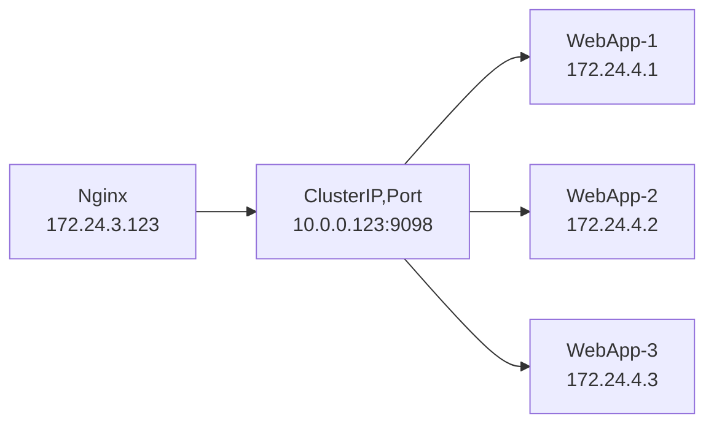
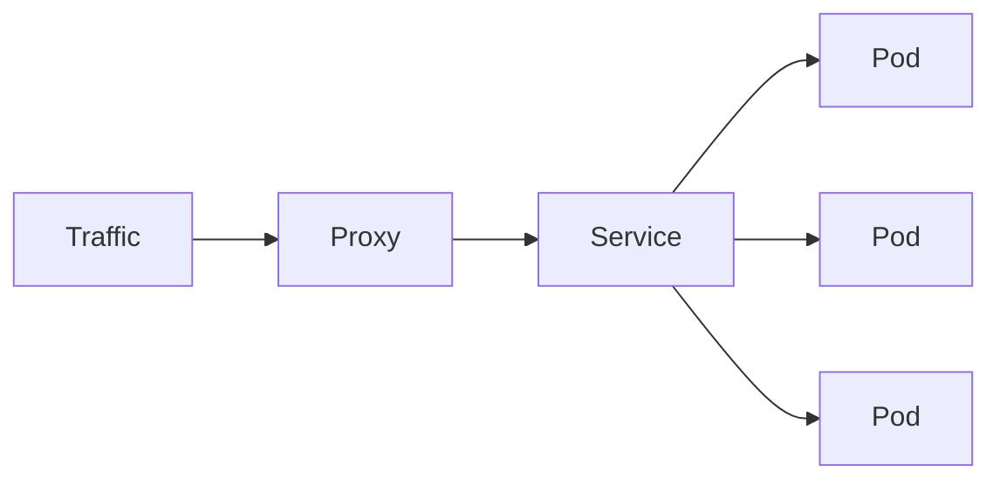
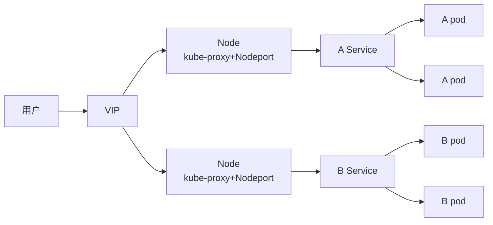
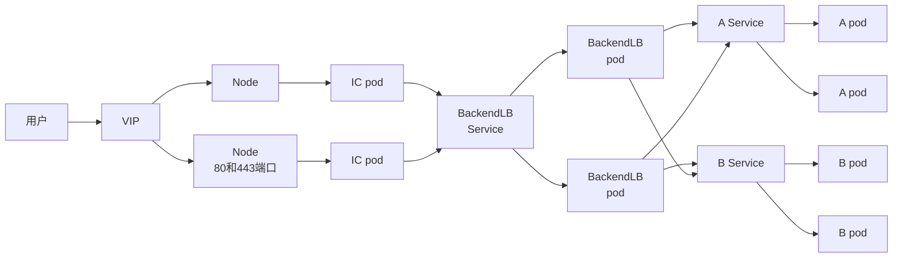

## 1.Pod、容器之间通讯方式

在Pod中运行多个容器，使得它们之间的通信非常直接。他们自己的通信有几种方法。

### 1.1.通过共享卷通信

在k8s中，Pod中的容器可以将共享卷当做一种简单和高效的共享数据方式。在大多数场景中，使用主机上的一个目录，并在多个容器间共享，是一种高效的方式，比如日志处理。

```
可以把一个Pod里的Volume挂载到应用容器的/var/log目录上。
然后，我在这个Pod里同时运行一个sidecar容器，它也声明挂载同一个Volume到自己的/var/log目录上。
这样，接下来 sidecar 容器就只需要做一件事儿，那就是不断地从自己的 /var/log 目录里读取日志文件，转发到 MongoDB 或者 Elasticsearch 中存储起来。
```

volume（卷）使得在容器重启后数据能被保存下来。卷具有和Pod一样的生命周期。这意味着，**只要Pod存在，卷就存在**。

如果Pod被删除了，即使一模一样的Pod被创建出来，原来Pod的共享卷也会被销毁，一个新的共享卷会被创建出来。

你可以使用一个共享的存储卷来简单高效的地在容器间共享数据.大多数情况下,使用一个共享目录在同一pod里的不同容器间共享数据就够了。

一个标准的同一pod内容器共享存储卷的用例是一个容器往共享存储卷里写入数据,其它的则从共享目录里读取数据

```yaml
apiVersion: v1
kind: Pod
metadata:
  name: mc1
spec:
  volumes:
    - name: html
      emptyDir: {}
  containers:
    - name: 1st
      image: nginx
      volumeMounts:
        - name: html
          mountPath: /usr/share/nginx/html
    - name: 2nd
      image: debian
      volumeMounts:
        - name: html
          mountPath: /html
```


### 1.2.进程间通信（Inter-Process Communication，IPC）

Pod中的容器共享同一个IPC命名空间，这意味着它们可以使用标准的进程间通信方式来互相通信，比如SystemV信号量和POSIX共享内存。

### 1.3.容器间的网络通信

pod内部容器是共享一个网络命名空间的，所以Pod中的容器可以通过localhost来互相通信。

而且对容器来说，hostname就是Pod的名称。

因为Pod中的所有容器共享同一个IP地址和端口空间，你需要为每个需要接收连接的容器分配不同的端口。也就是说，Pod中的应用需要自己协调端口的使用。

k8s在启动容器的时候会先启动一个pause容器，这个容器就是实现这个功能的。


在下面的例子中，我们会创建一个多容器Pod，其中一个容器中运行Nginx，它作为另一个容器中运行的web应用的反向代理。

（1）步骤1，为nginx配置文件创建一个**ConfigMap**。从80端口进来的HTTP请求会被转发到localhost上的5000端口。

```yaml
apiVersion: v1
kind: ConfigMap
metadata:
  name: mc3-nginx-conf
data:
  nginx.conf: |-
    user  nginx;
    worker_processes  1;
    
    error_log /var/log/nginx/error.log  warn;
    pid  /var/run/nginx.pid;
    
    events {
      worker_conections 1024;
    }
    http{
      include /etc/nginx/mime.types;
      
      sendfile  on;
      keepalive_timeout 65;
      upstream webapp {
        server 127.0.0.1:5000;
      }
    }
spec:
  volumes:
    - name: html
      emptyDir: {}
  containers:
    - name: 1st
      image: nginx
      volumeMounts:
        - name: html
          mountPath: /usr/share/nginx/html
    - name: 2nd
      image: debian
      volumeMounts:
        - name: html
          mountPath: /html
      command: ["/bin/sh", "-c"]
      args:
        - while true; do
            date >> /html/index.html;
            sleep 1;
          done
```

（2）步骤2：创建一个两容器Pod，一个容器运行nginx，另一个容器运行简单的web应用。注意我们只为Pod定义了80端口。端口5000不能被从Pod外部访问到。

```yaml
apiVersion: v1
kind: Pod
metadata:
  name: mc3
  labels:
    app: mc3
spec: 
  containers:
    - name: webapp
      image: training/webapp
    - name: nginx
      image: nginx:alpine
      ports:
        -containerPort: 80
      volumeMounts:
        - name: nginx-proxy-config
          mountPath:/ect/nginx/nginx.conf
          subPath:nginx.conf
volumes:
  - name: nginx-proxy-config
    configMap:
      name: mc3-nginx-conf
```

查看pod中的端口空间，能看到有80 和 5000端口。

```shell
netstat -lntp
```

（3）步骤3：将Pod暴露为一个 NodePort服务

```shell
kubectl expose pod mc3 --type=NodePort --port=80
service mc3 exposed
```

（4）步骤4：确认服务

```shell
kubectl describe svc mc3
```

现在，就可以使用浏览器或者curl工具来访问这个web应用了。

```shell
curl 10.70.209.68:32728
```

nginx容器的80端口上收到的HTTP请求会被转发到web应用容器的5000端口。

### 1.4.外网访问pod中的容器

两种方法：

一、手动创建service文件

1.创建nginx.yaml 

```yaml
apiVersion: apps/v1
kind: Deployment
metadata:
  name: nginx-deployment
spec:
  selector:
    matchLabels:
      app: nginx  
  replicas: 2
  template:
    metadata:
      labels:
        app: nginx  #就是说哪些Pod被Service池化是根据Label标签来的，此行nginx字样，后面我们创建Service会用到
    spec:
      containers:
        - name: nginx
          image: nginx
          ports:
            - containerPort: 80  #（容器内部开放的端口）
```

2.创建Deployment

```shell
kubectl create -f nginx.yaml 
```

3.创建`nginx-svc.yml `

```bash
注意：需要指定type类型NodePort，并且nodePort指定一个外部访问的port（范围：30000-32767）
```

```
selector选择之前Label标签为nginx的Pod作为Service池化的对象，最后说的是把Service的8080端口映射到Pod的80端口。
```

```yaml
apiVersion: v1
kind: Service
metadata:
  name: nginx-svc
spec:
  type: NodePort  #必须
  selector:
    app: nginx
  ports:
    - protocol: TCP
　　   nodePort：37844   #容器所在宿主机的端口
      port: 8080    #service的端口
      targetPort: 80  #容器的端口

```

4.创建service

```shell
kubectl apply -f nginx-svc.yml 
```

5.查看该Service

```shell
kubectl get  nginx-svc
```

6.查看该Service的描述信息

```shell
kuectl desribe service nginx-svc
```

最后总结：

集群内部：集群内部客户端访问service的入口，即`clusterIP:port`。

外网：外部流量通过访问`nodeIP:nodePort单个pod。`


二、手动创建service文件

使用kube expose命令


### 1.5.服务的四种类型

#### 1.5.1.ClusterIP

此类型会提供一个集群内部的虚拟IP（与Pod不在同一网段)，以供集群内部的pod之间通信使用。ClusterIP也是Kubernetes service的默认类型。



为了实现图上的功能主要需要以下几个组件的协同工作：

apiserver：在创建service时，apiserver接收到请求以后将数据存储到etcd中。

kube-proxy：k8s的每个节点中都有该进程，负责实现service功能，这个进程负责感知service，pod的变化，并将变化的信息写入本地的iptables中。

iptables：使用NAT等技术将virtual-IP的流量转至endpoint中。

```yaml
apiVersion: v1 
kind: Service 
metadata:   
  name: my-internal-service  
spec: 
  type: ClusterIP 
  selector:     
    app: my-app
  ports:   
    - name: http 
      port: 80 
      targetPort: 80 
      protocol: TCP 
```

如果 从Internet 没法访问 ClusterIP 服务，那么我们为什么要讨论它呢？那是因为我们可以通过 Kubernetes 的 proxy 模式来访问该服务！



**启动 Kubernetes proxy 模式：**

```shell
$ kubectl proxy --port=8080 

#这样你可以通过Kubernetes API，使用如下模式来访问这个服务：
http://localhost:8080/api/v1/proxy/namespaces/<NAMESPACE>/services/<SERVICE-NAME>:<PORT-NAME>/ 

#要访问我们上面定义的服务，你可以使用如下地址：
http://localhost:8080/api/v1/proxy/namespaces/default/services/my-internal-service:http/ 
```

**何时使用这种方式？**

有一些场景下，你得使用 Kubernetes 的 proxy 模式来访问你的服务：

- 由于某些原因，你需要调试你的服务，或者需要直接通过笔记本电脑去访问它们。
- 容许内部通信，展示内部仪表盘等。

这种方式要求我们运行 kubectl 作为一个未认证的用户，因此我们不能用这种方式把服务暴露到 internet 或者在生产环境使用。


#### 1.5.2.NodePort

NodePort模式除了使用cluster ip外，也将service的port映射到每个node的一个指定内部port上，映射的每个node的内部port都一样。
为每个节点暴露一个端口，通过nodeip + nodeport可以访问这个服务，同时服务依然会有cluster类型的ip+port。内部通过clusterip方式访问，外部通过nodeport方式访问。



NodePort 服务是引导外部流量到你的服务的最原始方式。NodePort，正如这个名字所示，在所有节点（虚拟机）上开放一个特定端口，任何发送到该端口的流量都被转发到对应服务。

```yaml
apiVersion: v1 
kind: Service 
metadata:   
  name: my-nodeport-service
spec: 
  type: NodePort 
  selector:     
    app: my-app 
  ports:   
    - name: http 
      port: 80 
      targetPort: 80 
      nodePort: 30036 
      protocol: TCP 
```

NodePort 服务主要有两点区别于普通的“ClusterIP”服务。它的类型是NodePort。有一个额外的端口，称为 nodePort，它指定节点上开放的端口值 。如果你不指定这个端口，系统将选择一个随机端口。

**这种方法有许多缺点：**

2. 每个端口只能是一种服务
3. 端口范围只能是 30000-32767


#### 1.5.3.loadbalance

LoadBalancer在NodePort基础上，K8S可以请求底层云平台创建一个负载均衡器，将每个Node作为后端，进行服务分发。该模式需要底层云平台（例如GCE）支持。

LoadBalancer 服务是暴露服务到 internet 的标准方式。在 GKE 上，这种方式会启动一个 Network Load Balancer[2]，它将给你一个单独的 IP 地址，转发所有流量到你的服务。

**何时使用这种方式？**

如果你想要直接暴露服务，这就是默认方式。所有通往你指定的端口的流量都会被转发到对应的服务。它没有过滤条件，没有路由等。这意味着你几乎可以发送任何种类的流量到该服务，像 HTTP，TCP，UDP，Websocket，gRPC 或其它任意种类。

这个方式的最大缺点是每一个用 LoadBalancer 暴露的服务都会有它自己的 IP 地址，每个用到的 LoadBalancer 都需要付费，这将是非常昂贵的。

如果想要在内网环境中，使用type=LoadBalancer就需要部署另外的插件，如MetalLB组件等。

**可以将一个节点设置不可调度**

```shell
$ kubectl cordon t90
$ kubectl uncordon t90
# kubectl cordon/uncordon 的确非常好用，之前一直用taint打污点的方式
```


#### 1.5.4.Ingress

Ingress，是一种HTTP方式的路由转发机制，由Ingress Controller和HTTP代理服务器组合而成。Ingress Controller实时监控Kubernetes API，实时更新HTTP代理服务器的转发规则。HTTP代理服务器有GCE Load-Balancer、HaProxy、Nginx等开源方案。

[详细说明请见http://blog.csdn.net/liyingke112/article/details/77066814](https://yq.aliyun.com/go/articleRenderRedirect?url=http%3A%2F%2Fblog.csdn.net%2Fliyingke112%2Farticle%2Fdetails%2F77066814)



有别于以上所有例子，Ingress 事实上不是一种服务类型。相反，它处于多个服务的前端，扮演着“智能路由”或者集群入口的角色。

你可以用 Ingress 来做许多不同的事情，各种不同类型的 Ingress 控制器也有不同的能力。

GKE 上的默认 ingress 控制器是启动一个 HTTP(S) Load Balancer[3]。它允许你基于路径或者子域名来路由流量到后端服务。例如，你可以将任何发往域名 foo.yourdomain.com 的流量转到 foo 服务，将路径 yourdomain.com/bar/path 的流量转到 bar 服务。

GKE 上用 L7 HTTP Load Balancer[4]生成的 Ingress 对象的 YAML 文件类似如下：

```yaml
apiVersion: extensions/v1beta1 
kind: Ingress 
metadata: 
  name: my-ingress 
spec: 
  backend: 
    serviceName: other 
    servicePort: 8080 
  rules: 
  - host: foo.mydomain.com 
    http: 
      paths: 
      - backend: 
          serviceName: foo 
          servicePort: 8080 
  - host: mydomain.com 
    http: 
      paths: 
      - path: /bar/* 
        backend: 
          serviceName: bar 
          servicePort: 8080 
```

**何时使用这种方式？**

Ingress 可能是暴露服务的最强大方式，但同时也是最复杂的。Ingress 控制器有各种类型，包括 Google Cloud Load Balancer， Nginx，Contour，Istio，等等。它还有各种插件，比如 cert-manager[5]，它可以为你的服务自动提供 SSL 证书。

如果你想要使用同一个 IP 暴露多个服务，这些服务都是使用相同的七层协议（典型如 HTTP），那么Ingress 就是最有用的。如果你使用本地的 GCP 集成，你只需要为一个负载均衡器付费，且由于 Ingress是“智能”的，你还可以获取各种开箱即用的特性（比如 SSL、认证、路由等等）。


### 1.6.port、nodePort、targetPort、containerPort的含义

#### 1.6.1.port

port是暴露在cluster ip上的端口，port提供了集群内部客户端访问service的入口，即`clusterIP:port`。

mysql容器暴露了3306端口（参考[DockerFile](https://github.com/docker-library/mysql/)），集群内其他容器通过33306端口访问mysql服务，但是外部流量不能访问mysql服务，因为mysql服务没有配置NodePort。对应的service.yaml如下：

#### 1.6.2.nodePort

nodePort提供了集群外部客户端访问service的一种方式，:nodePort提供了集群外部客户端访问service的端口，即`nodeIP:nodePort`提供了外部流量访问k8s集群中service的入口。

比如外部用户要访问k8s集群中的一个Web应用，那么我们可以配置对应service的`type=NodePort`，`nodePort=30001`。其他用户就可以通过浏览器`http://node:30001`访问到该web服务。

而数据库等服务可能不需要被外界访问，只需被内部服务访问即可，那么我们就不必设置service的NodePort。

#### 1.6.3.targetPort

targetPort是pod上的端口，从port/nodePort上来的数据，经过kube-proxy流入到后端pod的targetPort上，最后进入容器。

#### 1.6.4.containerPort

containerPort是在pod控制器中定义的、pod中的容器需要暴露的端口。

#### 1.6.5.port、nodePort总结

总的来说，port和nodePort都是service的端口，前者暴露给集群内客户访问服务，后者暴露给集群外客户访问服务。从这两个端口到来的数据都需要经过反向代理kube-proxy流入后端pod的targetPod，从而到达pod上的容器内。
