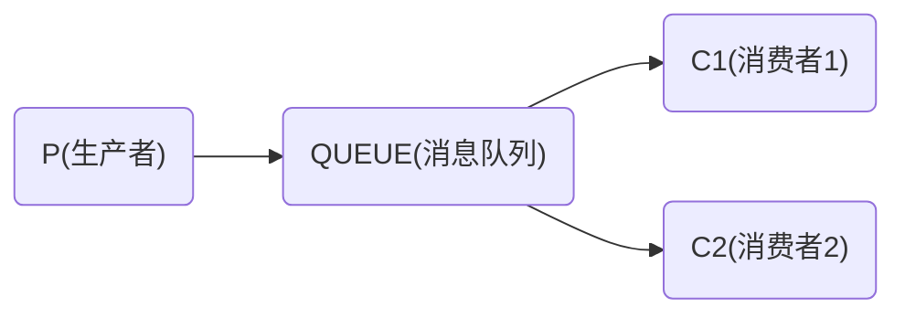
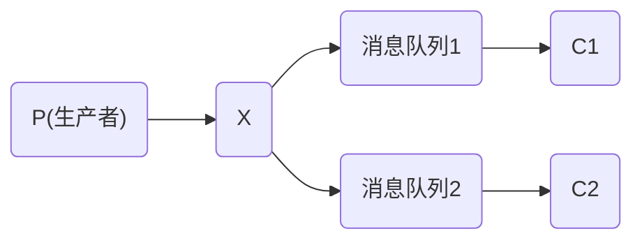
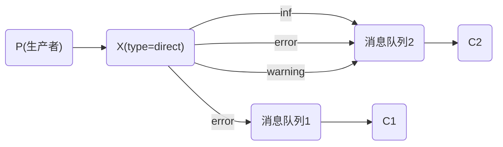
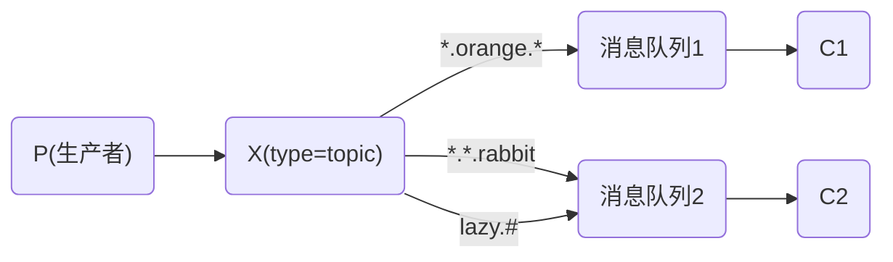

# 一、六种工作模式：

RabbitMQ是一个消息代理：它接受并转发消息。你可以把它当成一个邮局：当你想邮寄信件的时候，你会把信件放在投递箱中，并确信邮递员最终会将信件送到收件人的手里。在这个例子中，RabbitMQ就相当于投递箱、邮局和邮递员。

AMQP协议中的核心思想就是生产者和消费者隔离，生产者从**不直接将消息发送给队列**。生产者通常不知道是否一个消息会被发送到队列中，**只是将消息发送到一个交换机**。先由Exchange来接收，然后**Exchange按照特定的策略转发到Queue进行存储**。同理，消费者也是如此。**Exchange 就类似于一个交换机，转发各个消息分发到相应的队列中**。


1.简单模式：一个生产者，一个消费者

```java
1.生产者
/**
 * 队列名
 * 是否持久化
 * 是否排外:即只允许该channel访问该队列,一般等于true的话用于一个队列只能有一个消费者来消费的场景
 * 是否自动删除:队列不再使用时是否自动删除此队列
 * 队列参数
 * String queue, boolean durable, boolean exclusive, boolean autoDelete, Map<String, Object> arguments
 */
channel.queueDeclare(QUEUE_NAME, false, false, false, null);  //通道绑定队列
/**
 * 交换机 如果没有指定，则使用Default Exchange，注意简单模式和工作模式都不需要指定交换机，空字符串即可。
 * routingKey,消息的路由Key，用于交换机讲消息转发到指定队列----->默认的交换机，routingKey等于队列名称
 * 其他属性  消息包含的属性
 * 消息body
 */       
channel.basicPublish("", QUEUE_NAME,null,message.getBytes());//简单模式不用指定交换机,消息将发送给默认交换机

2.消费者
channel.queueDeclare(QUEUE_NAME, false, false, false, null);//通道绑定队列
QueueingConsumer consumer = new QueueingConsumer(channel); 
channel.basicConsume(QUEUE_NAME, true, consumer);
while(true){
	//该方法会阻塞
	QueueingConsumer.Delivery delivery = consumer.nextDelivery();
	String message = new String(delivery.getBody());
	System.out.println("[x] Received '"+message+"'");
}
```

2.work模式：一个生产者，多个消费者，每个消费者获取到的消息唯一。

```java
1.生产者:和简单模式是一样的 没有变化，直接发送给默认的交换机
/**
 * 队列名
 * 是否持久化
 * 是否排外:即只允许该channel访问该队列,一般等于true的话用于一个队列只能有一个消费者来消费的场景
 * 是否自动删除:队列不再使用时是否自动删除此队列
 * 队列参数
 * String queue, boolean durable, boolean exclusive, boolean autoDelete, Map<String, Object> arguments
 */
channel.queueDeclare(QUEUE_NAME, false, false, false, null);
/**
 * 交换机 如果没有指定，则使用Default Exchange，注意简单模式和工作模式都不需要指定交换机，空字符串即可。
 * routingKey,消息的路由Key，用于交换机讲消息转发到指定队列----->默认的交换机，routingKey等于队列名称
 * 其他属性  消息包含的属性
 * 消息body
 */
channel.basicPublish("", QUEUE_NAME,null,message.getBytes());//简单模式不用指定交换机

2.消费者
channel.queueDeclare(QUEUE_NAME, false, false, false, null);

//同一时刻服务器只会发送一条消息给消费者
channel.basicQos(1);

QueueingConsumer consumer = new QueueingConsumer(channel);
channel.basicConsume(QUEUE_NAME, false, consumer);
while(true){
	//该方法会阻塞
	QueueingConsumer.Delivery delivery = consumer.nextDelivery();
	String message = new String(delivery.getBody());
	System.out.println("[x] Received '"+message+"'");
    
    //这和简单模式不一样，需要自己去确认状态 调用ack
    channel.basicAck(delivery.getEnvelope().getDeliveryTag(), false);
    
}
```

3.订阅模式：一个生产者发送的消息会被多个消费者获取。

这种模式 比 工作模式多了一个交换机，交换机把消息发送到绑定的。

每个绑定的队列，都可以收到生产者发送的消息

```java
//BuiltinExchangeType.FANOUT
//生产者：
connection = connectionFactory.newConnection();
channel = connection.createChannel();
channel.exchangeDeclare(EXCHANGE, BuiltinExchangeType.FANOUT); //通道定义一个订阅模式的交换机  fanout
//String queue, boolean durable, boolean exclusive, boolean autoDelete, Map<String, Object> arguments
//队列名，是否持久化，是否独占，队列不用时是否自动删除此队列，队列参数map
channel.queueDeclare(QUEUE_EMAIL,true,false,false,null);//通道绑定邮件队列
channel.queueDeclare(QUEUE_SMS,true,false,false,null);//通道绑定短信队列
channel.queueBind(QUEUE_EMAIL,EXCHANGE,"");//队列和交换机绑定，但是没指定 路由key（第三个参数）
channel.queueBind(QUEUE_SMS,EXCHANGE,"");
channel.basicPublish(EXCHANGE,"",null,message.getBytes());//这个是发送到交换机上，路由key为空串

//邮件消费端（短信客户端与它类似）：
connection = connectionFactory.newConnection();
channel = connection.createChannel();
channel.exchangeDeclare(EXCHANGE, BuiltinExchangeType.FANOUT);//这需要额外的 声明交换机 方式
channel.queueDeclare(QUEUE_EMAIL,true,false,false,null);//通道绑定邮件队列
channel.queueBind(QUEUE_EMAIL,EXCHANGE,"");//交换机和队列绑定，不需要routingKey
DefaultConsumer consumer = new DefaultConsumer(channel) {…}
channel.basicConsume(QUEUE_EMAIL,true,consumer); //只监控一个队列 basicConsume的第二个参数是true
```

4.路由模式：发送消息到交换机并且要指定路由key ，消费者将队列绑定到交换机时需要指定路由key

```java
1.生产者：
public class Sender {
    private final static String EXCHANGE_NAME = "exchange_direct";
 	Connection connection = ConnectionUtil.getConnection();
    Channel channel = connection.createChannel();
    
    channel.exchangeDeclare(EXCHANGE_NAME,BuiltinExchangeType.DIRECT);//交换机type是direct
    channel.queueDeclare(QUEUE_EMAIL,true,false,false,null);//通道绑定邮件队列
	channel.queueDeclare(QUEUE_SMS,true,false,false,null);//通道绑定短信队列
    channel.queueBind(QUEUE_EMAIL,EXCHANGE_NAME,QUEUE_EMAIL_ROUTINGKEY);
	channel.queueBind(QUEUE_SMS,EXCHANGE_NAME,QUEUE_SMS_ROUTINGKEY);
    
    channel.basicPublish(EXCHANGE_NAME,QUEUE_EMAIL_ROUTINGKEY, null, "那一定是蓝色".getBytes());
    channel.basicPublish(EXCHANGE_NAME,QUEUE_SMS_ROUTINGKEY, null, "那一定是蓝色".getBytes());
}
消费者：
public class Receiver1 {
    private final static String EXCHANGE_NAME = "exchange_direct";
 	channel.exchangeDeclare(EXCHANGE_NAME, BuiltinExchangeType.DIRECT);
    channel.queueDeclare(QUEUE_EMAIL, false,false,false,null);
    channel.queueBind(QUEUE_EMAIL,EXCHANGE_NAME,QUEUE_EMAIL_ROUTINGKEY);
    channel.basicQos(1);
    QueueingConsumer consumer = new QueueingConsumer(channel);
    channel.basicConsume(QUEUE_EMAIL, false, consumer);
    while(true){
        QueueingConsumer.Delivery delivery = consumer.nextDelivery();
        String message = new String(delivery.getBody());
		//手动ack
        channel.basicAck(delivery.getEnvelope().getDeliveryTag(), false);
    }
}
消费者：
public class Receiver2 {
    private final static String EXCHANGE_NAME = "exchange_direct";
 	channel.exchangeDeclare(EXCHANGE_NAME, BuiltinExchangeType.DIRECT);
    channel.queueDeclare(QUEUE_SMS, false,false,false,null);
    channel.queueBind(QUEUE_SMS,EXCHANGE_NAME,QUEUE_SMS_ROUTINGKEY);
    channel.basicQos(1);
    QueueingConsumer consumer = new QueueingConsumer(channel);
    channel.basicConsume(QUEUE_SMS, false, consumer);

    while(true){
        QueueingConsumer.Delivery delivery = consumer.nextDelivery();
        String message = new String(delivery.getBody());
		//手动ack
        channel.basicAck(delivery.getEnvelope().getDeliveryTag(), false);
    }
}

路由模式下，一个队列可以绑定多个路由
```

5.topic模式：将路由键和某模式进行匹配，此时队列需要绑定在一个模式上，“#”匹配一个词或多个词，“*”只匹配一个词。

```java
生产者：
private final static String EXCHANGE_NAME = "exchange_topic";
private final static String EXCHANGE_TYPE = "topic";

public static void main(String[] args) throws IOException {
    Connection connection = ConnectionUtil.getConnection();
    Channel channel = connection.createChannel();
    //topic方式绑定交换机，也就是交换机是topic方式
    channel.exchangeDeclare(EXCHANGE_NAME, EXCHANGE_TYPE);//BuiltinExchangeType.TOPIC
    channel.queueDeclare(QUEUE_EMAIL,true,false,false,null);//通道绑定邮件队列
    channel.queueDeclare(QUEUE_SMS,true,false,false,null);//通道绑定短信队列
    
    channel.queueBind(QUEUE_EMAIL,EXCHANGE,"inform.#.email.#");
    channel.queueBind(QUEUE_SMS,EXCHANGE,"inform.#.sms.#");
    
    String message = "如果真爱有颜色";
    channel.basicPublish(EXCHANGE_NAME,"inform.email",null,message.getBytes());
    channel.basicPublish(EXCHANGE_NAME,"inform.sms",null,message.getBytes());    
}

消费者1：
public class Receiver1 {
    private final static String EXCHANGE_NAME = "exchange_topic";
    private final static String EXCHANGE_TYPE = "topic";
 
    public static void main(String[] args) throws IOException, InterruptedException {
        Connection connection = ConnectionUtil.getConnection();
        Channel channel = connection.createChannel();
        channel.exchangeDeclare(EXCHANGE, BuiltinExchangeType.TOPIC);
        channel.queueDeclare(QUEUE_EMAIL, false, false,false, null);
        
        channel.queueBind(QUEUE_NAME, EXCHANGE_NAME, "inform.#.email.#");
        channel.basicQos(1);
        QueueingConsumer consumer = new QueueingConsumer(channel);
        channel.basicConsume(QUEUE_EMAIL, false, consumer);
        while(true){
            QueueingConsumer.Delivery delivery = consumer.nextDelivery();
            String message = new String(delivery.getBody());
            channel.basicAck(delivery.getEnvelope().getDeliveryTag(), false);
        }
    }
}

消费者2：
public class Receiver2 {
    private final static String EXCHANGE_NAME = "exchange_topic";
    private final static String EXCHANGE_TYPE = "topic";
    public static void main(String[] args) throws IOException, InterruptedException {
        channel.exchangeDeclare(EXCHANGE, BuiltinExchangeType.TOPIC);
        channel.queueDeclare(QUEUE_SMS, false, false,false, null);
        channel.queueBind(QUEUE_SMS, EXCHANGE_NAME, "inform.#.sms.#");
        
        channel.basicQos(1);
        QueueingConsumer consumer = new QueueingConsumer(channel);
        channel.basicConsume(QUEUE_SMS, false, consumer);
        while(true){
            QueueingConsumer.Delivery delivery = consumer.nextDelivery();
            String message = new String(delivery.getBody());
            channel.basicAck(delivery.getEnvelope().getDeliveryTag(), false);
        }
    }
}
```


## 1、简单模式

Work queues 最基础简单的模式，多个消费者 消费同一个队列中消息。队列采用轮询方式将消息平均发送



特点：1个消息1个消费者，队列采用轮询方式消息平均发送，处理完一条才可以处理下条

生产端：声明队列，创建连接，创建channel，通道声明队列，指定消息，发送消息使用默认交换机

消费端：声明队列，创建连接，创建通道，通道声明队列，重写消息消费方法，执行消息方法。

 

生产的代码：建立TCP连接，创建channel通道（单个连接可多个通道），通道声明一个队列，通道发送消息basicPublish（交换机，队列，消息属性，消息体-byte数组）

生产者部分代码：

```java
connection = connectionFactory.newConnection();
channel = connection.createChannel();
channel.queueDeclare(QUEUE,true,false,false,null); 
channel.basicPublish("",QUEUE,null,message.getBytes("utf-8"));//这个是发送到队列上，交换机为空串
```

消费的代码：建立TCP连接，创建channel通道，通道声明队列，通过通道新建消费者（内部类重写处理接受到消息的方法），注册为消费者

消费者部分代码：

```java
connection = connectionFactory.newConnection();
channel = connection.createChannel();
channel.queueDeclare(QUEUE,true,false,false,null);
DefaultConsumer consumer = new DefaultConsumer(channel) {…}
channel.basicConsume(QUEUE,true,consumer);
```


## 2、Publish/subscribe发布订阅模式 

分发模式 FANOUT

消息会发送给所有消费者，生产者生产一条，所有消费者同时收到。持久化无效的。

发布订阅模式，相对于第一种模式，当前模式多了一个交换机。

生产者先把消息发送到交换机，再由交换机反消息发送到绑定的队列中，每个绑定的队列到能收到由客户端发送的消息。



每个消费者监听自己的队列，生产者将消息发给broker，再由交换机发送到绑定此交换机的每个队列。每个绑定到此交换机的队列，都会收到消息。

场景：用户通知，当用户转账完成，系统通知用户，通知方式有短信，邮件，语音多种方式。

只是比上面多了一个声明交换机的步骤，同时多了一个队列绑定交换机的步骤

消费者上，每个队列单独绑定消费方法。

```java
//生产者：
connection = connectionFactory.newConnection();
channel = connection.createChannel();
channel.exchangeDeclare(EXCHANGE, BuiltinExchangeType.FANOUT);
channel.queueDeclare(QUEUE_EMAIL,true,false,false,null);//通道绑定邮件队列
channel.queueDeclare(QUEUE_SMS,true,false,false,null);//通道绑定短信队列
channel.queueBind(QUEUE_EMAIL,EXCHANGE,"");//队列和交换机绑定，但是没指定路由，第三个参数
channel.queueBind(QUEUE_SMS,EXCHANGE,"");
channel.basicPublish(EXCHANGE,"",null,message.getBytes());//这个是发送到交换机上，队列是空串

//邮件消费端（短信客户端与它类似）：
connection = connectionFactory.newConnection();
channel = connection.createChannel();
channel.exchangeDeclare(EXCHANGE, BuiltinExchangeType.FANOUT);//这需要额外的 声明交换机 方式
channel.queueDeclare(QUEUE_EMAIL,true,false,false,null);//通道绑定邮件队列
channel.queueBind(QUEUE_EMAIL,EXCHANGE,"");
DefaultConsumer consumer = new DefaultConsumer(channel) {…}
channel.basicConsume(QUEUE_EMAIL,true,consumer); //只监控一个队列
```


## 3、Routing 路由模式 DIRECT

通过交换机和routingkey决定的唯一queue可以收到消息。

路由模式，类似发布订阅模，但是除了要绑定交换机之外，发送的时候还有指定routing key，这样发送消息的时候会发送到指定的队列上去。



```java
//生产者：
connectionFactory.newConnection();
channel = connection.createChannel();
channel.exchangeDeclare(EXCHANGE, BuiltinExchangeType.DIRECT);//声明交换机，类型DIRECT
channel.queueDeclare(QUEUE_EMAIL,true,false,false,null);//通道绑定邮件队列
channel.queueDeclare(QUEUE_SMS,true,false,false,null);
channel.queueBind(QUEUE_EMAIL,EXCHANGE,QUEUE_EMAIL);//路由模式 不仅指定交换机队列，还指定路由关键字，参数3.
channel.queueBind(QUEUE_SMS,EXCHANGE,QUEUE_SMS);
channel.basicPublish(EXCHANGE,QUEUE_EMAIL,null,message.getBytes());//向交换机中的邮件队列发送消息
channel.basicPublish(EXCHANGE,QUEUE_SMS,null,message.getBytes());

//邮件客户端（短信消费端同邮件）：
connection = connectionFactory.newConnection();
channel = connection.createChannel();
channel.exchangeDeclare(EXCHANGE, BuiltinExchangeType.DIRECT);//指定交换机和模式
channel.queueDeclare(QUEUE_EMAIL,true,false,false,null);//通道绑定邮件队列 邮件消费端绑定邮件队列
channel.queueBind(QUEUE_EMAIL,EXCHANGE,QUEUE_EMAIL);//队列交换机绑定，并指定关键字，参数3
DefaultConsumer consumer = new DefaultConsumer(channel) {…}
channel.basicConsume(QUEUE_EMAIL,true,consumer);//绑定消费端

```


## 4、Topics 匹配订阅模式 TOPIC

所有符合routingkey(可以是一个表达式)的queue可以接收到消息。

和routing路由模式最大区别，就是topics模式发送消息和消费消息通过通配符去匹配。



```java
//生产端代码：
connection = connectionFactory.newConnection();
channel = connection.createChannel();
channel.exchangeDeclare(EXCHANGE, BuiltinExchangeType.TOPIC);//注意这个地方路由类型是TOPIC
channel.queueDeclare(QUEUE_EMAIL,true,false,false,null);//通道绑定邮件队列
channel.queueDeclare(QUEUE_SMS,true,false,false,null);//通道绑定短信队列
channel.queueBind(QUEUE_EMAIL,EXCHANGE,"inform.#.email.#");//交换机绑定队列 指定topic
channel.queueBind(QUEUE_SMS,EXCHANGE,"inform.#.sms.#");
channel.basicPublish(EXCHANGE,"inform.email",null,message.getBytes()); //交换机 topic
channel.basicPublish(EXCHANGE,"inform.sms",null,message.getBytes());
channel.basicPublish(EXCHANGE,"inform.email.sms",null,message.getBytes());
//邮件消费端(短信消费端同)：
connection = connectionFactory.newConnection();
channel = connection.createChannel();
channel.exchangeDeclare(EXCHANGE, BuiltinExchangeType.TOPIC);
channel.queueDeclare(QUEUE_EMAIL,true,false,false,null);//通道绑定邮件队列
channel.queueBind(QUEUE_EMAIL,EXCHANGE,"inform.#.email.#");
DefaultConsumer consumer = new DefaultConsumer(channel) {…}
channel.basicConsume(QUEUE_EMAIL,true,consumer);

```


## 5、Header 模式，性能很差，几乎不用

header模式与routing不同的地方在于，header模式取消routingkey，使用header中的 key/value（键值对）匹配队列。

```java
//生产：
connection = connectionFactory.newConnection();
channel = connection.createChannel();
channel.exchangeDeclare(EXCHANGE, BuiltinExchangeType.HEADERS);
channel.queueDeclare(QUEUE_EMAIL,true,false,false,null);//通道绑定邮件队列
channel.queueDeclare(QUEUE_SMS,true,false,false,null);//通道绑定短信队列

Map<String,Object> headers_email = new Hashtable<String,Object>();
headers_email.put("inform_type","email");
Map<String,Object> headers_sms = new Hashtable<String, Object>();
headers_sms.put("inform_type","sms");
channel.queueBind(QUEUE_EMAIL,EXCHANGE,"",headers_email);
channel.queueBind(QUEUE_SMS,EXCHANGE,"",headers_sms);

Map<String,Object> headers = new Hashtable<String,Object>();
headers.put("inform_type","email");//匹配email通知消费者绑定的header
AMQP.BasicProperties.Builder properties = new AMQP.BasicProperties.Builder();
properties.headers(headers);
channel.basicPublish(EXCHANGE,"",properties.build(),message.getBytes());

//邮件消费端（短信同）：
connection = connectionFactory.newConnection();
channel = connection.createChannel();
channel.exchangeDeclare(EXCHANGE, BuiltinExchangeType.HEADERS);
channel.queueDeclare(QUEUE_EMAIL,true,false,false,null);//通道绑定邮件队列
Map<String,Object> headers_email = new Hashtable<String,Object>();
headers_email.put("inform_email","email");
channel.queueBind(QUEUE_EMAIL,EXCHANGE,"",headers_email);
DefaultConsumer consumer = new DefaultConsumer(channel) {…}
channel.basicConsume(QUEUE_EMAIL,true,consumer);

```


## 6、RPC DIRECT

RPC即客户端远程调用服务端的方法 ，使用MQ可以实现RPC的异步调用，基于Direct交换机实现，流程如下：

1、客户端即是生产者也是消费者，向RPC请求队列发送RPC调用消息，同时监听RPC响应队列。

2、服务端监听RPC请求队列的消息，收到消息后执行服务端的方法，得到方法返回的结果。

3、服务端将RPC方法 的结果发送到RPC响应队列。

4、客户端（RPC调用方）监听RPC响应队列，接收到RPC调用结果。


# 二、DirectExchange

## pom配置

```xml
<dependency>
	<groupId>org.springframework.boot</groupId>
    <artifactId>spring-boot-starter-amqp</artifactId>
</dependency>
```

 

## yml配置

其中手动ack和每次获取消息数量从这进行配置。

```yaml
spring:
  rabbitmq:
  virtual-host: admin_vhost
  host: 192.168.1.100
  port: 5672
  username: admin
  password: admin_password
  listener:
    simple:
      concurrency: 1  #1个线程
      acknowledge-mode: MANUAL  #手动ack
      prefetch: 1  #从消息队列中获取的数量
```

 

自己配置的二个生产和消费的一些自定义配置：

```yaml
#rabbitmq消息队列 一个消息可以发送多个队列
sender:
  exchange: sender_exchange
  queues:
    - routingkey: sender_routingkey
      queue: sender_queue
receiver:
  exchange: receive_exchange
  routingkey: receive_routingkey
  queue: receive_queue
```


## RabbitmqAdmin配置

此类用于绑定队列和交换机

```java
package com.vfenv.config;

import org.springframework.amqp.rabbit.connection.ConnectionFactory;
import org.springframework.amqp.rabbit.core.RabbitAdmin;
import org.springframework.context.annotation.Bean;
import org.springframework.context.annotation.Configuration;

@Configuration
public class RabbitmqConfig {
    @Bean
    public RabbitAdmin getRabbitAdmin(ConnectionFactory connectionFactory) {
        return new RabbitAdmin(connectionFactory);
    }
}
```


## 生产者代码

```java
package com.vfenv.mq;
import lombok.Data;
import org.springframework.amqp.core.AmqpTemplate;
import org.springframework.amqp.rabbit.core.RabbitAdmin;
import org.springframework.beans.factory.InitializingBean;
import org.springframework.amqp.core.DirectExchange;
import org.springframework.amqp.core.Exchange;
import org.springframework.beans.factory.annotation.Autowired;
import org.springframework.boot.context.properties.ConfigurationProperties;
import org.springframework.context.annotation.Bean;
import org.springframework.stereotype.Component;
import java.util.List;
import java.util.Map;

@Data
@Component
@ConfigurationProperties(prefix = "sender")
public class WorkerSender implements InitializingBean{
    @Autowired
    private AmqpTemplate rabbitAmqpTemplate;
    
    @Autowired
    private RabbitAdmin rabbitAdmin;
    
    //设置交换机名称
    private String exchange;
    private List<Map<String, String>> queues;
    public void send(String msg) {
        //如果要发非持久化消息
        /*MessageProperties propertie = new MessageProperties();
        propertie.setDeliveryMode(MessageDeliveryMode.NON_PERSISTENT);
        Message message = new Message(msg.getBytes(),propertie);*/
        if (queues != null && queues.size() > 0) {
            queues.forEach(x -> {
                this.rabbitAmqpTemplate.convertAndSend(this.exchange, x.get("routingkey"), msg);
            });
        }
    }
    
    @Override
    public void afterPropertiesSet() throws Exception {
        rabbitAdmin.declareExchange(new DirectExchange(this.exchange));
        if (queues != null && queues.size() > 0) {
            for (Map<String, String> x : queues) {
                rabbitAdmin.declareQueue(new Queue(x.get("queue")));
                rabbitAdmin.declareBinding(new Binding(x.get("queue"), Binding.DestinationType.QUEUE,
                        this.exchange, x.get("routingkey"), new HashMap()));
            }
        }
    }
}
```


## 消费者代码

```java
package com.vfenv.mq;
import com.rabbitmq.client.Channel;
import org.springframework.amqp.core.ExchangeTypes;
import org.springframework.amqp.rabbit.annotation.*;
import org.springframework.amqp.support.AmqpHeaders;
import org.springframework.messaging.handler.annotation.Header;
import org.springframework.messaging.handler.annotation.Payload;
import org.springframework.stereotype.Component;
@Component
@RabbitListener(bindings = @QueueBinding(
        value = @Queue(value = "${receiver.queue}", autoDelete = "false", durable = "true"),
        exchange = @Exchange(value = "${receiver.exchange}", durable = "true", type = ExchangeTypes.DIRECT),
        key = "${receiver.routingkey}"))
public class WorkerReceiver {
    @RabbitHandler
    public void process(@Payload String message, @Header(AmqpHeaders.DELIVERY_TAG) long deliveryTag, Channel channel) {
        try {
            System.out.println("consumer1-->" + message);
            Thread.sleep(1000);
            //手动ack
            channel.basicAck(deliveryTag, false);
        } catch (Exception e) {
            try {
                //重新放回队尾
                channel.basicNack(deliveryTag, false, true);
            } catch (Exception exception) {
                exception.printStackTrace();
            }
        }
    }
}
```


# 三、广播消息

## 发送者

```java
package com.vfenv.mq;

import org.springframework.amqp.core.AmqpTemplate;
import org.springframework.beans.factory.annotation.Autowired;
import org.springframework.beans.factory.annotation.Value;

@Component
public class SubSender {
    @Autowired
    private AmqpTemplate rabbitAmqpTemplate;

    @Value("${sub.exchange}")
    private String exchange;

    public void send(String msg) {
        this.rabbitAmqpTemplate.convertAndSend(this.exchange, "", msg);
    }
}

```

## 接收者1

```java
package com.vfenv.mq;

import org.springframework.amqp.core.ExchangeTypes;
import org.springframework.amqp.rabbit.annotation.*;

@Component
@RabbitListener(bindings = @QueueBinding(
        value = @Queue(value = "", autoDelete = "false"),
        exchange = @Exchange(value = "${sub.exchange}", type = ExchangeTypes.FANOUT)
))
public class SubReceiver {
    @RabbitHandler
    public void process(String msg) {
        System.out.println(msg);
    }
}
```


# 四、python使用消息队列

## 配置文件

```python
import os
class Config:
    # mysql 配置文件
    MYSQL_IP = os.getenv("MYSQL_URL", "192.168.1.100")
    MYSQL_NAME = os.getenv("MYSQL_NAME", "root")
    MYSQL_PASSWORD = os.getenv("MYSQL_PASSWORD", "root")
    MYSQL_DB_NAME = os.getenv("MYSQL_DB_NAME", "db_att")

    # 消息队列配置文件
    MQ_IP = os.getenv("MQ_IP", "192.168.1.100")
    MQ_PORT = os.getenv("MQ_PORT", 5672)
    MQ_USER_NAME = os.getenv("MQ_USER_NAME", "admin")
    MQ_PASSWORD = os.getenv("MQ_PASSWORD", "admin")
    MQ_VIRTUAL_HOST = os.getenv("MQ_VIRTUAL_HOST", "admin_vhost")

    # 消息队列接收端配置
    MQ_REC_QUEUE = os.getenv("MQ_REC_QUEUE", "test_queue")
    MQ_REC_EXCHANGE = os.getenv("MQ_REC_EXCHANGE", "test_exchange")
    MQ_REC_ROUTING_KEY = os.getenv("MQ_REC_ROUTING_KEY", "test_key")

    # 消息队列发送端配置
    MQ_SEND_EXCHANGE = os.getenv("MQ_SEND_EXCHANGE", "back_exchange")
    MQ_SEND_ROUTING_KEY = os.getenv("MQ_SEND_ROUTING_KEY", "back_key")


__all__ = ["Config"]

```

## 主方法

```python
import pika
import time
import json
import pymysql
import uuid
from consumer_config import Config
from pymongo import MongoClient
import gridfs


# 通过组id将附件从gridfs下载，存放到本地, 使用完毕需要删除（服务器那边删 这边不用处理）
def get_file(message_id):
    conn = MongoClient(Config.MONGO_IP, Config.MONGO_PORT)
    db = conn[Config.MONGO_DB_NAME]
    fs = gridfs.GridFS(db, collection=Config.MONGO_TABLE_NAME)
    cursor = fs.find({"metadata.groupId": message_id})
    file_list = list()
    for file in cursor:
        # metadata = file.metadata
        # method = metadata.get('method')
        with open(file.filename, 'wb') as f:
            while True:
                data = file.read()
                if not data:
                    break
                f.write(data)
            file_list.append(f)
    # print(len(file_list))
    # print(file_list[0])  # 在coco里调用接口只有一个文件
    conn.close()
    return file_list

# msql数据库获取connection
def connection_mysql():
    mysqldb = pymysql.connect(Config.MYSQL_IP, Config.MYSQL_NAME, Config.MYSQL_PASSWORD, Config.MYSQL_DB_NAME)
    cursor = mysqldb.cursor()
    return mysqldb, cursor

# 消费消息队列中消息
def deal_message(ch, method, properties, body):
    log_start_time = time.strftime('%Y-%m-%d %H:%M:%S')
    print(log_start_time)
    # 从消息队列中获取json参数，提前约定好
    para = json.loads(body)
    param1 = para['param1']
    
    # 调用算法之前记录日志，接收到消息
    message_id = uuid.uuid1()
    log_mysql_db, log_mysql_cursor = connection_mysql()
    sql = """insert into t_rabbit_receive_message(message_id, 
             task_id, rabbit_id, start_time, receive_message, process_status) 
             VALUES ('%s', '%s', '%s', '%s', 'true', 'processing') """ % \
          (message_id, task_id, rabbit_id, log_start_time)
    try:
        log_mysql_cursor.execute(sql)
        log_mysql_db.commit()
    except:
        log_mysql_db.rollback()
    finally:
        log_mysql_db.close()

    try:
        # TODO 实际处理方法
        
        # 记录一下处理完成的时间
        log_end_time = time.strftime('%Y-%m-%d %H:%M:%S')
    except:
        send_msg(task_id, rabbit_id, log_end_time, "fail", "failed")
    else:
        send_msg(task_id, rabbit_id, log_end_time, "success", "successed")
        
    channel.basic_ack(delivery_tag=method.delivery_tag, multiple=False)


# 成功或者失败，都要反写消息队列
def send_msg(task_id, rabbit_id, log_end_time, msg_status, db_status):
    connection_back = pika.BlockingConnection(
        pika.ConnectionParameters(host=Config.MQ_IP, port=Config.MQ_PORT, virtual_host=Config.MQ_VIRTUAL_HOST,
                                  credentials=credentials, heartbeat=0))
    channel_back = connection_back.channel()
    channel_back.exchange_declare(exchange=Config.MQ_SEND_EXCHANGE, durable=False, exchange_type='direct')
    message_back = json.dumps({'taskId': task_id, 'status': msg_status, 'rabbitId': rabbit_id})
    channel_back.basic_publish(exchange=Config.MQ_SEND_EXCHANGE, routing_key=Config.MQ_SEND_ROUTING_KEY,
                               body=message_back, properties=pika.BasicProperties(delivery_mode=2))
    # mysql写日志
    log_mysql_db, log_mysql_cursor = connection_mysql()
    sql = """UPDATE t_rabbit_receive_message SET process_status = '%s', 
            back_message = 'true', end_time = '%s' where rabbit_id = '%s'""" % \
          (db_status, log_end_time, rabbit_id)
    try:
        log_mysql_cursor.execute(sql)
        log_mysql_db.commit()
    except:
        log_mysql_db.rollback()
    finally:
        log_mysql_db.close()


# 主方法
if __name__ == "__main__":
    credentials = pika.PlainCredentials(Config.MQ_USER_NAME, Config.MQ_PASSWORD)
    connection = pika.BlockingConnection(
        pika.ConnectionParameters(host=Config.MQ_IP, port=Config.MQ_PORT, virtual_host=Config.MQ_VIRTUAL_HOST,
                                  credentials=credentials,
                                  heartbeat=0))
    channel = connection.channel()
    result = channel.queue_declare(Config.MQ_REC_QUEUE, durable=True)
    channel.exchange_declare(exchange=Config.MQ_REC_EXCHANGE, durable=True, exchange_type='direct')
    channel.queue_bind(exchange=Config.MQ_REC_EXCHANGE, queue=result.method.queue,
                       routing_key=Config.MQ_REC_ROUTING_KEY)
    # 设置公平策略
    channel.basic_qos(prefetch_count=1)
    channel.basic_consume(queue=result.method.queue, on_message_callback=deal_message, auto_ack=False, exclusive=False)
    channel.start_consuming()

```


